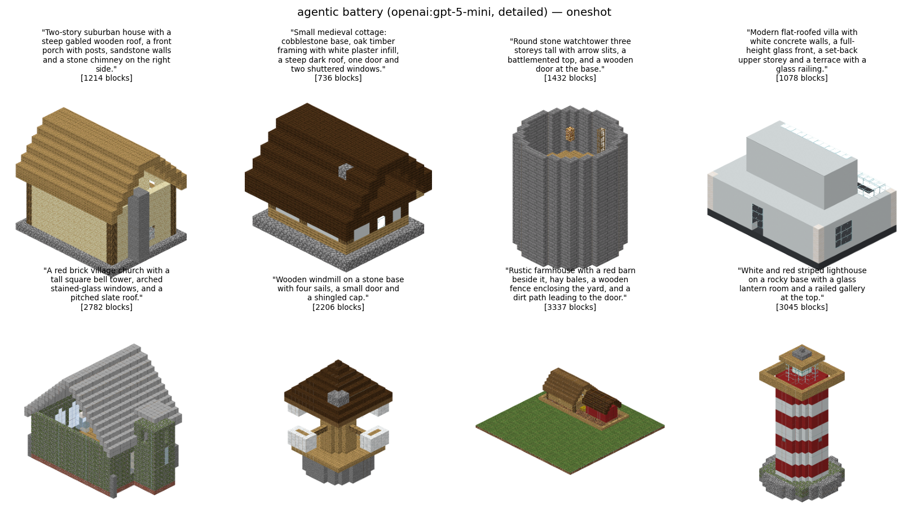
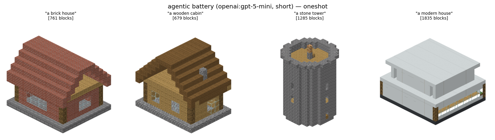

# Agentic generation (Track E) — an LLM writes the build *program*

Tracks A–D make a model emit **one token per voxel**. Track E makes a frontier LLM
emit a **short program** in a WorldEdit-flavored command language, and executes it
onto a voxel canvas.

```
prompt ──► [plan] ──► LLM ──► program ──► executor ──► Canvas ──► Structure
                       ▲                     │
                       └── repair / critique ─┘   (errors, no-ops, rendered views)
```

That change of representation is the whole thesis of the track:

| | per-voxel tracks (A–D, and the [LLM baseline](#relationship-to-the-llm-baseline-track-d)) | Track E |
|---|---|---|
| cost of a build | ~10.7 tokens **per block** | ~9 tokens **per command**, and one command places tens–hundreds of blocks |
| a median house | ~7.8k tokens (only 77/2661 fit a 2k cap) | ~40 lines |
| build size | capped by context | ~25 blocks/command measured; thousands of blocks routinely |
| canvas size | fixed at train time (32³) | any size, per run |
| text conditioning | needs a labeled corpus + training | free with the base model |
| image conditioning | needs an encoder + training | free with the base model |

## What it produces

Twelve builds, `gpt-5-mini`, `oneshot` arm (one in-context example, **no** planning,
**no** repair, **no** critique — the cheapest real arm), 48³ canvas, one API call each.
Every build is titled with the exact text it was conditioned on.



/// caption
`--prompts detailed --n 8` · mean 1,979 blocks · 8/8 non-empty · 0 failed commands out
of 334 · coherence 0.875 · **$0.034 for all eight**
(`outputs/run_20260728_084343_agentic_showcase_detailed/`).
///



/// caption
`--prompts short --n 4` · the same model and arm on four-word prompts · mean 1,140
blocks · 4/4 single-component · **$0.015 for all four**
(`outputs/run_20260728_084550_agentic_showcase_short/`).
///

Read them together: the terse prompts get *generically* correct buildings (a brick
house is a brick house), while the detailed prompts get the specific features asked for
— the windmill has four sails and a shingled cap, the lighthouse is red-and-white
striped with a railed gallery, the villa has a set-back upper storey and a glass front.
That is the text-conditioning payoff, and it costs neither training nor a labeled corpus.

For scale, the per-voxel LLM baseline on this same family of prompts produced
~150–200-block builds at a 0.26 parse rate zero-shot (notes §21).

Full numbers and caveats: [T22](results.md).

---

## Quick start

```bash
# 1. keys — put whichever you use in the repo .env (never committed)
#    OPENAI_API_KEY=…      GEMINI_API_KEY=…      ANTHROPIC_API_KEY=…
# 2. deps (the openai client also drives Gemini via its compat endpoint)
.venv/bin/pip install -e '.[agentic]'

# one build, everything on
.venv/bin/python scripts/run_agentic.py \
    "a small oak cottage with a cobblestone chimney and a steep gabled roof" \
    --provider openai:gpt-5-mini --canvas 32 --plan --examples 1 \
    --repair-rounds 1 --critique-rounds 1

# the ablation battery (5 arms × 12 prompts)
.venv/bin/python -m blockgen.experiments_agentic --config agentic-scaffolding

# no API key needed: the scripted provider runs the whole loop offline
.venv/bin/python -m blockgen.experiments_agentic --quick --provider mock
.venv/bin/python scripts/run_agentic.py --program my_build.txt   # executor only
.venv/bin/python scripts/run_agentic.py --list-commands
```

Every run lands in `outputs/run_<stamp>_<name>/` with `summary.md`, `metrics.json`,
`samples.png` (textured, titled by prompt), the programs, the full transcripts, and a
structure cache in the repo's standard `.npz` format.

---

## The build language

`blockgen/agentic/dsl.py`. One command per line, `#` comments, `key=value` for tail
arguments, a leading `/` or `//` tolerated (models reflexively write WorldEdit
syntax). Coordinates are **integers, inclusive at both ends, y up, origin at the
canvas corner** — the same convention as `Structure` indexing.

```
  set <block> <x> <y> <z>                                     aliases: block, place
  fill <block> <x1> <y1> <z1> <x2> <y2> <z2>                  aliases: cuboid
  clear <x1> <y1> <z1> <x2> <y2> <z2>                         aliases: erase, delete
  box <block> <x1> <y1> <z1> <x2> <y2> <z2> [thickness=1]     aliases: hollow, faces
  walls <block> <x1> <y1> <z1> <x2> <y2> <z2> [thickness=1]
  replace <from_block> <to_block> <x1> <y1> <z1> <x2> <y2> <z2>
  line <block> <x1> <y1> <z1> <x2> <y2> <z2> [thickness=1]
  sphere <block> <cx> <cy> <cz> <radius> [hollow=false]
  cylinder <block> <cx> <cy> <cz> <radius> <height> [hollow=false] [axis=y]
  pyramid <block> <cx> <cy> <cz> <size> [hollow=false]
  gable <block> <x1> <y1> <z1> <x2> <y2> <z2> [axis=x] [overhang=0] [solid=false] [riser=true]
  copy <x1> <y1> <z1> <x2> <y2> <z2>
  paste <x> <y> <z> [rotate=0] [mirror=none]
  stack <x1> <y1> <z1> <x2> <y2> <z2> <dir> <count>
```

`scripts/run_agentic.py --list-commands` prints the live reference — and it is the
*same string the model is given*, so the docs cannot drift from the language.

A worked program (this is one of the in-context examples, `blockgen/agentic/examples.py`):

```
fill cobblestone 0 0 0 11 0 9          # 1. plinth
walls oak_planks 1 1 1 10 4 8          # 2. shell
fill oak_planks 1 1 1 10 1 8           #    floor
line oak_log 1 1 1 1 4 1               # 3. corner posts (timber framing)
clear 5 1 1 6 3 1                      # 4. cut the doorway…
set oak_door 5 1 1                     #    …then dress it
fill glass_pane 3 2 1 3 3 1
fill oak_planks 1 5 1 10 5 8           # 5. ceiling
gable oak_stairs 1 5 1 10 5 8 axis=x overhang=1
fill cobblestone 9 1 9 9 7 9           # 6. chimney
```

### Blocks

Modern names, because that is the vocabulary frontier models know:
`oak_planks`, `stone_bricks`, `white_concrete`. State properties are supported where
legacy metadata can carry them — `oak_stairs[facing=north,half=top]`, `oak_log[axis=x]`,
`stone_slab[type=top]` — and translate to the exact legacy bits
`deploy/inference/blockgen_server/blockmap.py` reads back, so a facing survives all the
way into a live Minecraft server. Everything else resolves through
`blockgen/utils/block_remap.py`, the same family-level table the text2mc corpus import
uses. An unknown name is a **per-line error**, never a silent stone substitution — that
keeps palette drift visible in the metrics instead of hiding it in grey blobs.

`blockgen/agentic/blockstate.py::PALETTE` is the ~70-name curated list advertised in
the system prompt; a test asserts every entry resolves and that they do not collapse
onto each other.

That list is the model's entire view of the material world. [Block
ontology](ontology.md) replaces it, under `--ontology mined`, with the same 70
names plus what each one *is* — colour and surface measured from the shipped
textures, placement behaviour and material affinity mined from the corpus:

```bash
.venv/bin/python -m blockgen.ontology          # mine it (~1 s over 2661 builds)
.venv/bin/python scripts/run_agentic.py "a spruce lodge" --ontology mined
```

### Failure handling (why the loop can learn from it)

* **Parse** and **execute** are separate. Bad syntax is caught with a line number
  before anything runs; a failing command is recorded and skipped while the rest of
  the program still executes. A program with three bad lines out of eighty still
  produces a build *plus* a precise list of what to fix.
* Writes outside the canvas are **clipped and counted**, not fatal.
* A command that changes **zero blocks** is a warning — that is almost always a
  coordinate bug and it is the single most useful signal to hand back to the model.
* Prose and code fences around the program are tolerated and counted (`n_skipped`).

### Adding a command

One decorator. The parser, `--list-commands`, the system prompt and the repair prompt
all read the same registry, so a new primitive is documented to the model the moment
it exists:

```python
@register(
    "dome", (Param("block", "block"), Param("cx", "int"), Param("cy", "int"),
             Param("cz", "int"), Param("radius", "int")),
    "Hemispherical dome.", "dome quartz_block 8 6 8 5",
)
def _cmd_dome(canvas, a):
    ...
    return n_voxels_changed          # the change count feeds the no-op warning
```

`tests/test_agentic_dsl.py::test_every_command_example_parses_and_runs` then holds you
to a valid example, because the example is shown to the model verbatim.

---

## The loop

`blockgen/agentic/agent.py`. Every stage is independently switchable, which is what
makes the battery an ablation rather than a demo.

| Stage | Flag | What it does | Why it might matter |
|---|---|---|---|
| plan | `--plan` | a natural-language design pass (dimensions, palette, parts list) before any code | separates *design* from *coordinate arithmetic* |
| examples | `--examples k` | k in-context example programs, retrieved by keyword overlap | one demonstration is the cheapest fix for format + grounding |
| generate | — | emit the program | |
| execute | — | run it, collect errors / no-ops / clipping | |
| repair | `--repair-rounds N` | re-prompt with the execution report | **symbolic** feedback; cheap and precise |
| critique | `--critique-rounds M` | re-prompt with **rendered views** of the build | **visual** feedback; catches what coordinates cannot say |

Details that matter in practice:

* **Rollback.** If a repair or critique round returns an empty build, the previous
  build is kept. A loop that turns a good build into nothing is worse than no loop.
* **History.** `keep_history=True` (default) shows the model its own previous programs,
  so a round is a conversation, not a fresh start.
* **Critique modes.** `--critique-mode rewrite` asks for the whole program again;
  `patch` asks for extra commands that run on the canvas as-is (cheaper, and it cannot
  destroy what already works).
* **Image conditioning** is the same code path as visual critique:
  `--image ref.png` (repeatable) attaches reference images to the build request.
* **Rendering is optional.** On a box without EGL the critique stage degrades to a
  logged note; the run still finishes.

```python
from blockgen.agentic import AgentConfig, build_one

result = build_one("a red brick village church with a tall bell tower",
                   config=AgentConfig(provider="gemini:gemini-2.5-pro",
                                      canvas_size=(64, 64, 64), plan=True,
                                      n_examples=1, repair_rounds=2,
                                      critique_rounds=1))
result.structure        # a blockgen.utils.data.Structure, like any other track
result.program_text     # the program that built it
result.metrics()        # blocks, components, command success rate, tokens, $
```

---

## Providers, caching, cost

`blockgen/agentic/providers.py`. The agent never imports a vendor SDK — it talks to
`LLMProvider`, selected by a string:

| Spec | Backend | Notes |
|---|---|---|
| `openai:gpt-5-mini` | OpenAI Chat Completions | reasoning models get `max_completion_tokens` + `reasoning_effort` automatically |
| `gemini:gemini-2.5-flash` | `google-genai` if installed, else Google's **OpenAI-compatible endpoint** | no extra dependency required |
| `anthropic:claude-sonnet-4-5` | Anthropic Messages | |
| `mock` / `mock:replies.json` | scripted replies | the whole loop, offline, no key |

* **Keys** come from the environment, falling back to the repo `.env`. Nothing logs a key.
* **Responses are cached on disk** (`outputs/agentic_cache/`), keyed by the full
  request — model, messages (images hashed), sampling params. Re-running a battery to
  add a metric, re-render, or resume a crashed sweep costs **nothing** and returns
  byte-identical text, which makes an otherwise non-reproducible step reproducible.
  `--no-cache` bypasses it.
* **Cost** is tracked per call from the usage fields and priced by
  `providers.PRICES` (approximate list prices; edit freely, nothing depends on them).
* **Reasoning-token trap**, inherited from the LLM-baseline track: `gpt-5*` bill
  thinking against the completion budget, so a small cap silently returns empty
  content. Handled here by defaulting to a 16k budget; `--reasoning-effort low` is the
  cheap setting for what is mostly a serialization task.

Adding a provider is a subclass with one method (`complete`) plus an entry in
`_PROVIDERS`; multimodal parts and caching come from the base classes.

---

## Experiments

`blockgen/experiments_agentic.py`. Every arm sees the **same prompts**, so the
comparison isolates the loop rather than the request.

| Arm | plan | examples | repair | critique |
|---|---|---|---|---|
| `zeroshot` | – | 0 | 0 | 0 |
| `oneshot` | – | 1 | 0 | 0 |
| `plan` | ✓ | 0 | 0 | 0 |
| `repair` | – | 0 | 2 | 0 |
| `critique` | – | 0 | 1 | 1 |
| `full` | ✓ | 1 | 2 | 1 |

Plus the **ontology** arms, which move a different knob — what the model is told
about the *materials* rather than how many passes it gets. All four are `oneshot`
with one setting changed, so the comparison isolates the block reference table:

| Arm | block reference in the system prompt | prompt size |
|---|---|---|
| `ont_none` | the bare 70-name palette list (as shipped) | ~1.3k tokens |
| `ont_mined` | the measured catalog — colour, layer, form, affinity, rules | ~4.3k |
| `ont_shuffled` | **the control**: the same table, attributes permuted onto the wrong blocks, token-matched to `ont_mined` | ~4.3k |
| `ont_stats` | mined fields only — no colours, no game rules | ~3.2k |

`ont_mined` beating `ont_none` is not a result; `ont_mined` beating `ont_shuffled`
is. See [Block ontology](ontology.md), and build the catalog with
`python -m blockgen.ontology` before running these.

A new ablation is one dict entry in `ARMS`, not a new code path.

### Prompt sets (`blockgen/agentic/tasks.py`)

| Source | What |
|---|---|
| `short` | terse prompts ("a brick house") — minimal grounding, the hard case |
| `detailed` | rich hand-written prompts in the style of our VLM captions |
| `large` | multi-part / long-horizon requests (a village square, a castle complex) |
| `captions:k` | **real** captions from `data/minecraft/labels/houses_32_captions.json` at detail level k (0 = short tag, 1–2 = richer) |
| `path.txt` / `path.json` | your own |

`captions:0` and `captions:2` describe *the same builds* at different detail levels
under the same `--seed`, which is what makes the prompt-detail ablation paired
(`configs/experiments/agentic-detail.yaml`) instead of confounded with subject matter.

### Configs

```bash
.venv/bin/python -m blockgen.experiments_agentic --config agentic-scaffolding   # 5 arms × 12 detailed prompts
.venv/bin/python -m blockgen.experiments_agentic --config agentic-detail --prompts captions:0 --name agentic_detail_short
.venv/bin/python -m blockgen.experiments_agentic --config agentic-detail --prompts captions:2 --name agentic_detail_rich
.venv/bin/python -m blockgen.experiments_agentic --config agentic-large        # 96³ canvas, long-horizon builds
.venv/bin/python -m blockgen.experiments_agentic --config agentic-ontology    # does a mined block ontology beat the model's priors?
```

Same layered YAML system as every other battery (`blockgen/config.py`): CLI flags
still win over the config, and `configs/agentic/loop-{full,cheap}.yaml` are the
reusable loop fragments.

### Metrics

Per build (`BuildResult.metrics()`), aggregated per arm:

| Metric | Meaning |
|---|---|
| `blocks` | placed blocks — the scale number |
| `n_components`, `largest_component_frac` | 6-connectivity, **the same notion `blockgen/eval/validity.py` applies to the neural tracks**, so an agentic build and an AR sample are judged identically |
| `coherence_rate` | fraction of builds where one component holds ≥90% of the blocks |
| `command_success_rate`, `n_noop_commands` | did the language land? |
| `blocks_per_command` | the leverage the DSL is actually buying |
| `clipped_writes` | how often the model planned outside the canvas |
| `completion_tokens`, `cost_usd`, `elapsed_s` | what it cost |

The component scan is skipped above 40k blocks (pure-Python flood fill) and reported
as `null` — a speed guard, not a semantic one.

### Artifacts

```
outputs/run_<stamp>_<name>/
  config.json                    the AgentConfig + arm definitions + the prompts
  metrics.json                   per-build metrics + per-arm aggregates
  summary.md                     the table you actually read
  samples.png, samples_<arm>.png textured renders, titled by prompt
  <arm>_<dim>.npz + _manifest    builds in the STANDARD structure-cache format
  builds/<arm>/NNN_program.txt   the program
  builds/<arm>/NNN_plan.txt      the plan (when planning is on)
  builds/<arm>/NNN_transcript.json  every request and response
```

The `.npz` is exactly what `blockgen.curation.houses.save_house_cache` writes, so:

```python
from blockgen.curation.houses import load_structures_from_cache
structures, manifest = load_structures_from_cache("outputs/run_…/full_48.npz")
manifest["items"][0]["title"]   # the prompt that produced it
```

…which means agentic builds drop straight into the existing novelty
(`blockgen/eval/novelty.py`), perceptual (`blockgen/eval/perceptual.py`) and render
tooling with no converter.

---

## In Minecraft (the live server)

The agentic track is servable through the same inference server and Fabric mod as the
trained checkpoints (the `deploy/` stack) — `deploy/inference/models.json`
carries two entries, `agentic` and `agentic_plus`, and each is a **group** that serves
every model in its list:

```
/model agentic list                      # the models it serves + availability
/model agentic gemini-3.5-flash          # -> agentic:gemini-3.5-flash
/gen a wooden windmill on a stone base   # real text conditioning
```

The vendor is inferred from the model name, so you type `gemini-3.5-flash`, not
`gemini:gemini-3.5-flash`. A member whose API key is missing lists as unavailable with
that reason instead of failing at generate time.

**The build goes up command by command.** The server does not dump the finished
structure: it re-executes the program through
`ProgramRunner(..., track_voxels=True)` and sends one batch per command, labelled
with the command that produced it. In world you watch the foundation appear, then the
walls, then the doorway being *cut* (cleared voxels are streamed as
`minecraft:air`, so openings really open), then the roof.

```
  [1/48] fill cobblestone 15 0 15 25 4 25
  [2/48] replace cobblestone mossy_cobblestone 15 0 15 25 1 25
  ...
Done: 2915 blocks in 65.1s from agentic:gemini-3.5-flash (seed 11).
  gemini:gemini-3.5-flash  48 commands  2147+1071 tokens  cost unknown (model not in the price table)
```

Batch metadata (`step`) and the closing accounting (`stats`) ride as optional fields
on message types that already existed, so a mod built before this change still works.
Cost is printed per build because an API model spends real money on `/gen`; a model
missing from `providers.PRICES` reports **cost unknown** rather than `$0.00`.

One honest caveat: this streams *execution*, not *generation*. The LLM call completes
before the first block appears (25–70 s), then the replay is fast.

## Where it plugs into the rest of the repo

| Seam | How |
|---|---|
| `Structure` | `Canvas.to_structure()` — agentic output *is* the repo's structure type |
| Rendering | `blockgen/eval/cond_render.textured_prompt_grid`, same sheets as every conditioned run |
| Eval | novelty / perceptual / validity all take `Structure` lists |
| Live Minecraft | Served as `agentic:<model>` by `deploy/inference` — see [In Minecraft](#in-minecraft-the-live-server). Block-state bits are aligned with `deploy/…/blockmap.py`, so a program's `[facing=north]` survives into the world |
| **Editing an existing build** | `structure_to_canvas(structure)` seeds the canvas from a real corpus build — the agent can then *extend, in-fill or restyle* it instead of building from scratch |
| Retrieval | `examples.select_examples` is keyword-overlap today; swapping in CLIP text embeddings (`blockgen/labeling/embed_conditions.py`) touches nothing else |
| **Materials** | `blockgen/ontology` mines the corpus for what each block *is* and renders it into the system prompt in place of the bare palette list — see [Block ontology](ontology.md) |

## Relationship to the LLM baseline (Track D)

`scripts/train_llm_brickgpt.py` / `zeroshot_brickgpt.py` (notes §21) test the *per-voxel*
serialization: one line per block. That track's finding — a LoRA-finetuned 1.5B model
(0.87 parse) beats prompted `gpt-5-mini` (0.26) — is about a format where the frontier
model must place every voxel by hand. Track E changes the format instead of the model.
The two are complementary, and the honest comparison to make is **at equal cost**:
tokens and dollars per coherent build, not parse rate.

## Known limits

* **No inverse compiler.** We cannot turn a corpus build back into a program, so there
  is no supervised training signal here and no mined in-context examples — the examples
  are hand-written demonstrations of *technique*.
* **Novelty is unmeasured against the corpus.** Nearest-neighbor IoU against
  `houses_32` is the natural next number for this track and is not yet run.
* **Family-level materials.** `polished_deepslate_stairs` becomes plain stone stairs —
  inherited from `block_remap`, fine for shape/material learning, not a lossless format.
* **The clipboard is a single slot**, and there are no variables, loops or user-defined
  functions in the language. Those are the obvious next primitives if programs start
  hitting repetition limits.
* **Cost scales with rounds.** `full` is ~4–5 calls per build. Use the cache, and start
  with `configs/agentic/loop-cheap.yaml`.
