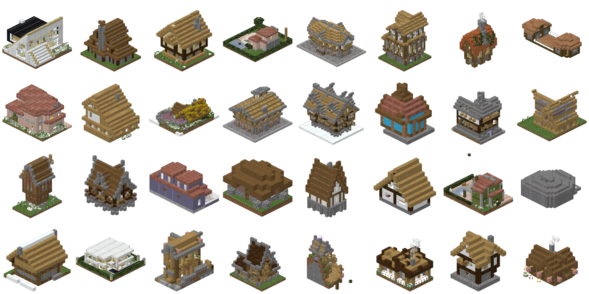
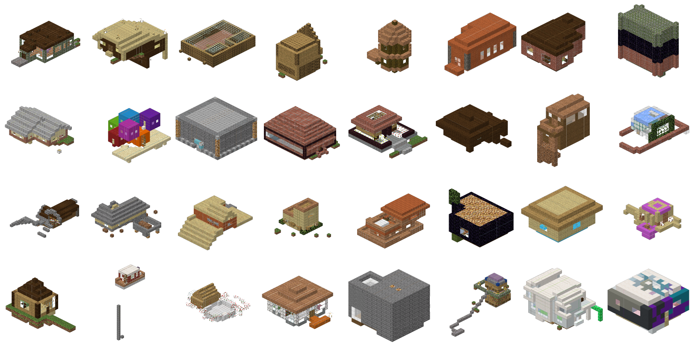
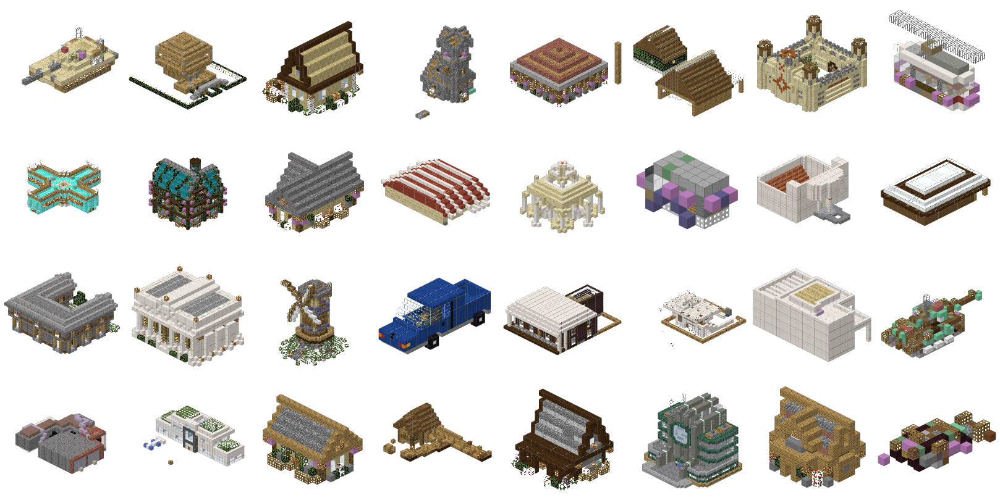
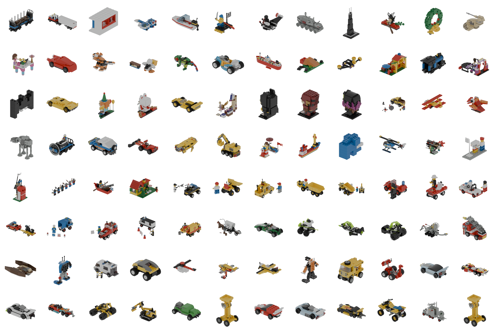
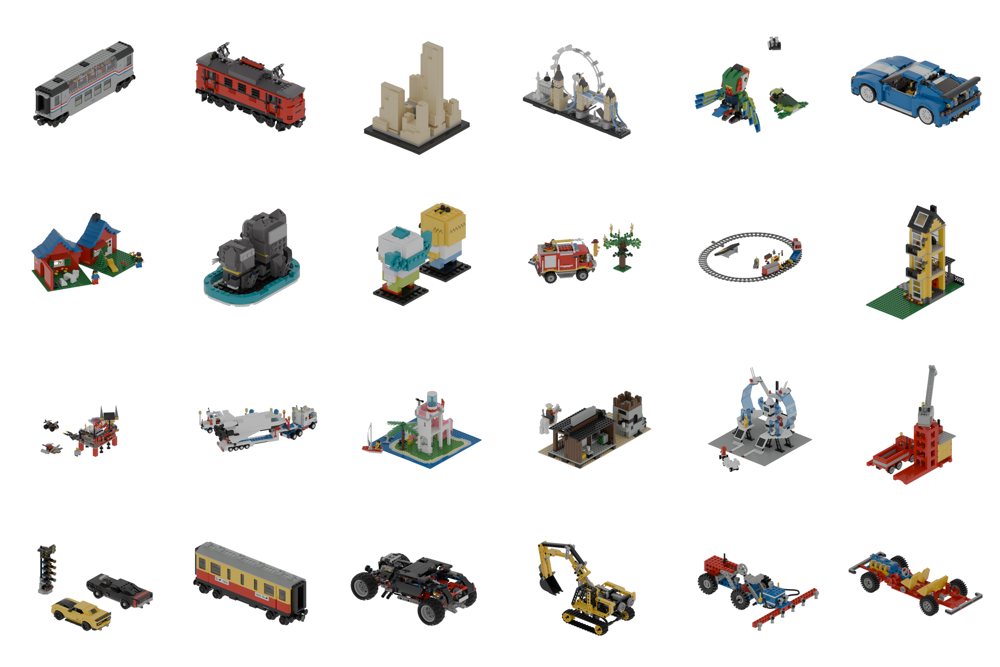

# Data & curation

BlockGen trains on two media. The full per-corpus inventory — counts, licenses, labels,
and sample sheets for every source — is in [`data_sources.md`](https://github.com) at the
repo root. This page is the site-embedded summary plus the **Curator** API.

## Minecraft corpora (voxel builds — legacy `(id, data)` vocab)

| Corpus | Path | Size | License | Labels |
|---|---|--:|---|---|
| **GrabCraft** | `data/minecraft/grabcraft/` | 6,560 builds | site user-content (research use) | 5 top-level / 113 sub categories, title, dims, tags, views; **exact `(id,data)`** |
| **3D-Craft** | `data/minecraft/3d_craft/` | 2,537 houses | research (Meta AI CraftAssist) | single class + timestamped placement traces |
| **text2mc** | `data/minecraft/text2mc/` | 11,092 h5 + 28,235 `.schem` (~39k) | Kaggle/CC (research) | free-text tags on every build |
| **tfrecord crawl** | `data/minecraft/more/` | 36,290 NBT / 69,363 meta | PlanetMinecraft user-content | 15 map categories + views/downloads/diamonds |
| Legacy schematics | `data/minecraft/raw/` | 12,366 `.schematic` | mixed (drifted crawl) | none reliable |
| Block vocab ref | `data/minecraft/block_ids.csv` | 933 block types | minecraft-data (MIT) | id/name/material/light/… |

- **GrabCraft** is the labeled workhorse. Blocks decode to an **exact `(id, data)`** via
  each build's `"<legacy_id>_<data>.png"` texture field — oak vs spruce planks are
  distinguished (both are `minecraft:planks` by name). Top-level split: Buildings 3,744 ·
  Transportation 1,317 · Outdoors 910 · Statues 303 · Pixel Art 286.
- **3D-Craft** records each house as a *placement sequence* (`placed.json`:
  `(tick, player, xyz, (id,meta), 'P'|'B')`) plus a final `schematic.npy` — unique temporal
  supervision usable for build-order curricula (`utils/ordering.py`).
- **text2mc** is modern *flattened* blocks remapped to our legacy vocab via
  `utils/block_remap.py` (97% state coverage); `tok2block.json` has 3,717 names. The 11k
  `.h5` are pre-tokenized (`corpora.load_text2mc`); the **28k raw `.schem`** the author never
  converted are decoded by `utils/schem.py` (Sponge palette + varint `BlockData`) and loaded
  by `corpora.load_text2mc_schem` — together the dataset's advertised ~40k builds. Free
  PlanetMinecraft `TAGS` give a coarse category per build (`labeling/categorize.py`).
- **tfrecord crawl**: `schematics/*.tfrecords` (36,290) pair a `url` with gzipped-NBT
  `schematicData` (the metadata join key); parsed by hand (no TensorFlow) in
  `blockgen/data/tfrecord_dataset.py`. Labeled cache `tf_small_24` keeps **5,866**
  structures, 100% with metadata, across 15 categories (Land Structure 1,723, Redstone
  1,287, 3D Art 1,264, …).
- `data/raw` is a **drifted** older download whose filenames map to no reliable metadata
  (only ~5% content-match the tfrecords) — kept for volume, not used for labeling.

### The curated house dataset (the training target)

`blockgen/curation/houses.py` pools GrabCraft + 3D-Craft + text2mc (`.h5`) + text2mc_schem
(`.schem`) into a shared legacy vocab, then applies a per-corpus enclosed-air "house-ness"
gate + variant-aware dedup. Load via `load_house_structures(max_dim)`.

| Cache | Pooled | Quality drops | Exact dups | **Final** | GrabCraft | 3D-Craft | text2mc `.h5` | text2mc `.schem` |
|---|--:|--:|--:|--:|--:|--:|--:|--:|
| `houses_32` | 3,493 | 826 | 6 | **2,661** | 1,360 | 1,267 | 34 | — |
| `houses_48` | 4,502 | 1,381 | 33 | **3,088** | 1,410 | 1,381 | 180 | **117** |

`houses_48` rebuilt 2026-07-17 with the new `text2mc_schem` source (28k raw `.schem`, decoded
via `utils/schem.py`): +**117** clean room-bearing houses (of 348 pooled), lifting text2mc's
house contribution 180 → 297 and the pool 2,971 → 3,088. The payoff is scale-dependent — only
**8** schem houses clear the cap at 32³ vs **348** at 48³ (schem builds are mostly oversized
world exports), so `houses_32` is left unchanged. The general `.schem` corpus
(`corpora.load_text2mc_schem`) also serves shape pretraining at bigger volumes.

The top drop reason is **no-interior** (675 at 32³): the enclosed-air gate (≥8 interior air
voxels unreachable from the bbox boundary) rejects trees/vehicles/roof fragments. It's
corpus-calibrated — 17% of ground-truth GrabCraft houses have open interiors (GrabCraft is
exempt) vs 31% of 3D-Craft and 54% of text2mc — yielding **~3.7–4.2× more clean houses**
than the old 714-house labeled subset.

Per-corpus splits of `houses_32`, real Minecraft textures (`blockgen/renderer/grid.py`):

| GrabCraft | 3D-Craft | text2mc |
|---|---|---|
|  |  |  |

/// caption
The three corpora that compose the curated house set, rendered with the headless
pyrender + real-texture pipeline. GrabCraft dominates the clean-house count; 3D-Craft adds
volume; text2mc contributes a small tail after remap + gating.
///

## LEGO corpora (brick assemblies — LDraw geometry)

Fetched 2026-07-07 (roadmap Phase 0); see [`data/lego/README.md`](https://github.com) for
fetch commands and `research.md §E` for the typed-connection thesis.

| Corpus | Path | Size | License | Labels |
|---|---|--:|---|---|
| **OMR** (Open Model Repository) | `data/lego/omr/` | 1,463 sets → 1,819 models · 651,017 placements | **CC BY 4.0** (per file) | set → title; color + 3×3 rotation + part ref per placement |
| **StableText2Brick** | `data/lego/stabletext2brick/` | ~42k train + test | **MIT** | text captions + per-brick stability + ShapeNet category |
| LDraw parts library | `data/lego/ldraw/` | 33,362 part `.dat` | **CC BY 2.0** | part geometry (primitives + meshes) |
| LDCad Shadow Library | `data/lego/shadow/` | 4,251 files | **CC BY-SA 4.0** | connectivity metas (studs/anti-studs/clips/axles/pins) |

- **OMR** is the license-clean core: **5,173 unique part types** (the diverse, *non-cuboid*
  vocabulary the thesis targets — tires, slopes, curved panels, Technic gears/axles,
  minifigs, BrickHeadz, architecture). Parts/model median 156, mean 447, p90 1,107.
  **Connectivity coverage** (joining the shadow library transitively) is 91.1% of
  placements / 88.4% of parts → restrict the generation vocab to covered parts and keep
  >91% of the corpus. Example set: `10014-1` "Caboose".
- **StableText2Brick** (BrickGPT/LegoGPT corpus) restricts to **8 cuboid brick types**
  (`1x1`…`2x6`) but is big and eval-comparable; each structure has multiple captions +
  per-brick stability scores. Not LDraw (format `hxw (x,y,z)`) → not yet rendered.
- **Connectivity is NOT in base LDraw** — always join the **Shadow Library** for
  stud ↔ anti-stud mates. Its coverage is a subset of parts, which drives the
  restrict-to-covered-parts decision. LegoACE's LegoVerse (55k, 9,314 parts) is not public.

Rendered with a separate Blender 4.2 + ImportLDraw package (`legogen/renderer/`), same
white-background orthographic-isometric aesthetic as the Minecraft sheets:



/// caption
`omr_grid.png` — 96 small/medium official OMR sets (part-ref band 15–160). The non-cuboid
part diversity (slopes, tires, panels, Technic) is exactly what the typed-connection LEGO
track is designed to place.
///



/// caption
`omr_showcase.png` — 24 larger, part-diverse sets (band 200–700), rendered bigger.
///

---

## The Curator

`blockgen/curation/curate.py` computes per-structure **features** — dims, block count,
density, footprint, height, block-type count, dominant material, connectivity, and an
exact **`(id, data)` palette signature** — plus metadata on the labeled cache.

```python
from blockgen.curation import Curator
lab = Curator.from_labeled_cache(max_dim=24)

# slice by anything
houses = (lab.search("house")
            .filter(category_in=["Land Structure Map","Air Structure Map","Other Map","Complex Map"])
            .filter(min_blocks=60, max_components=3, min_block_types=3))

# group / dedupe
lab.group_by_similarity(iou_threshold=0.6)   # GPU occupancy-IoU union-find
lab.find_exact_duplicates()                  # same shape AND palette -> drop extras
lab.find_variant_groups()                    # same shape, DIFFERENT materials -> KEEP
lab.auto_mark_reliable(min_diamonds=10)      # popularity seed set
```

`Curator.from_grabcraft_cache()` loads the GrabCraft caches in the same layout. For the
cross-corpus house build, use `blockgen.curation.houses` directly.

### Variant-aware dedup (important)

The scraped set has many near-duplicates. Some are **true copies** (same shape *and*
identical `(id,data)` palette) — safe to drop extras. Others are **material variants**
(same shape, different woods/wools/colors) — these are *kept*, because learning that a
build exists in oak, spruce, and birch is a feature, not noise. The `(id,data)` palette
signature is what distinguishes them (resource-location names alone can't: oak vs spruce
planks are both `minecraft:planks`).


/// caption
A curated subset (houses). The curator also surfaces material-variant groups — e.g. the
same "Big _ Ore" cube in redstone / lapis / gold / diamond / coal — and keeps all of them.
///

## Named subsets

`blockgen/experiments.py::build_subsets` defines the coherent subsets we train and show
off: `houses` (~714), `pixel_art` (~124), `redstone`, `towers`, `trees`, `popular`
(≥10 diamonds). Decisions persist to `data/cache/curation_decisions.json`. The current
training target, though, is the larger cross-corpus `houses_32` / `houses_48` above.
