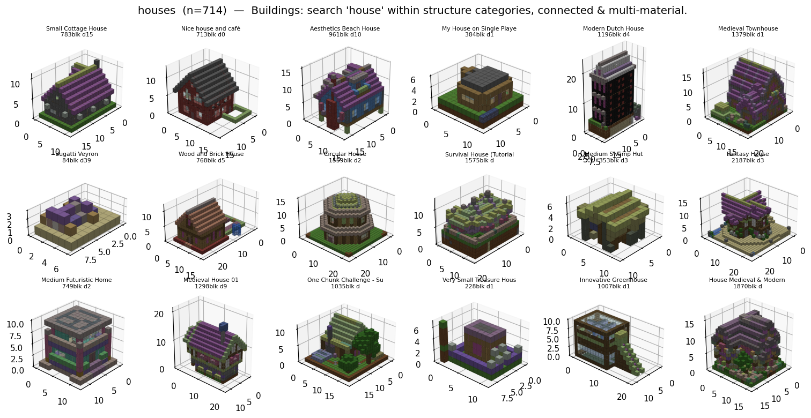

# Data & curation

## Sources

- `data/more/minecraft-schematics-dataset/` — the crawl:
    - `fullSchematics.json` — 69,363 records keyed by planetminecraft `url`
      (title, subtitle/category, tags, description, views, downloads, diamonds, …).
    - `schematics/*.tfrecords` — 36,290 records, each pairing a `url` with the gzipped-NBT
      `schematicData`. **This is the metadata join key.**
- `data/raw/*.schematic` — a separate, *drifted* download. Its filenames map to **no**
  metadata (verified: file 1 ≠ record 0 by any offset; only ~5% content-match the
  tfrecords). Do not use it for labeling.

!!! note "Why label from the tfrecords"
    Because `data/raw` can't be reliably labeled, the labeled cache is built straight from
    the tfrecords: `blockgen/data/tfrecord_dataset.py` parses the TFRecord framing +
    `tf.train.Example` protobuf **by hand** (no TensorFlow), decodes each schematic via
    `SchematicFile.from_fileobj(io.BytesIO(gzip.decompress(bytes)))`, and writes
    `tf_small_<dim>.npz` + `tf_small_<dim>_meta.json`. ~100% of kept structures carry
    metadata.

The labeled cache (`--max-dim 24`) keeps **5,866** structures (cropped, `max_dim ≤ 24`,
`8 ≤ blocks ≤ 4096`) across 15 categories (Land Structure, Redstone Device, 3D Art, …).

### GrabCraft (category-labeled expansion)

[GrabCraft](https://www.grabcraft.com) organizes builds into a clean human category tree
(Houses → Medieval / Wooden / Modern / …), which is exactly the per-type supervision we
want. It has no schematic download, but every build page references a
`myRenderObject_<id>.js` served from `/js/RenderObject/` whose body is a nested JSON dict
(one entry per occupied block). Each entry carries a **`texture` field of the form
`"<legacy_id>_<data>.png"`** — the classic pre-flattening numeric id + data — so blocks
decode to an **exact `(id, data)`** with no fuzzy name matching (it lines up with
`STANDARD_VOCAB`; a name reverse-lookup is only a fallback for blank textures).

Two stages, mirroring the tfrecord split:

- `blockgen/data/grabcraft_scraper.py` — crawls a category's paginated listing
  (`/minecraft/<cat>/pg/<N>`), resolves each build's render object + page metadata
  (title, dims, tags, views), and writes one **resumable** JSON per build under
  `data/grabcraft/raw/<subcategory>/<slug>.json`. Rate-limited; re-runs skip existing.
- `blockgen/data/grabcraft_dataset.py` — decodes those artifacts into `Structure`s and
  writes `gc_small_<dim>.npz` + `gc_small_<dim>_meta.json` in the **same layout** as the
  tf cache, so the Curator loads it unchanged via `Curator.from_grabcraft_cache()`.

```bash
python -m blockgen.data.grabcraft_scraper --category houses      # network → raw JSON
python -m blockgen.data.grabcraft_dataset --max-dim 24           # raw → labeled cache
```

## The Curator

`blockgen/curation/curate.py` computes per-structure **features** — dims, block count,
density, footprint, height, block-type count, dominant material, connectivity, and an
exact **`(id, data)` palette signature** — plus metadata on the labeled cache.

```python
from blockgen.curation import Curator
lab = Curator.from_labeled_cache(max_dim=24)

# slice by anything
houses = (lab.search("house")
            .filter(category_in=["Land Structure Map","Air Structure Map","Other Map","Complex Map"])
            .filter(min_blocks=60, max_components=3, min_block_types=3))

# group / dedupe
lab.group_by_similarity(iou_threshold=0.6)   # GPU occupancy-IoU union-find
lab.find_exact_duplicates()                  # same shape AND palette -> drop extras
lab.find_variant_groups()                    # same shape, DIFFERENT materials -> KEEP
lab.auto_mark_reliable(min_diamonds=10)      # popularity seed set
```

### Variant-aware dedup (important)

The scraped set has many near-duplicates. Some are **true copies** (same shape *and*
identical `(id,data)` palette) — safe to drop extras. Others are **material variants**
(same shape, different woods/wools/colors) — these are *kept*, because learning that a
build exists in oak, spruce, and birch is a feature, not noise. The `(id,data)` palette
signature is what distinguishes them (resource-location names alone can't: oak vs spruce
planks are both `minecraft:planks`).



/// caption
A curated subset (houses). The curator also surfaces material-variant groups — e.g. the
same "Big _ Ore" cube in redstone / lapis / gold / diamond / coal — and keeps all of them.
///

## Named subsets

`blockgen/experiments.py::build_subsets` defines the coherent subsets we train and show
off: `houses` (~714), `pixel_art` (~124), `redstone`, `towers`, `trees`, `popular`
(≥10 diamonds). Decisions persist to `data/cache/curation_decisions.json`.
