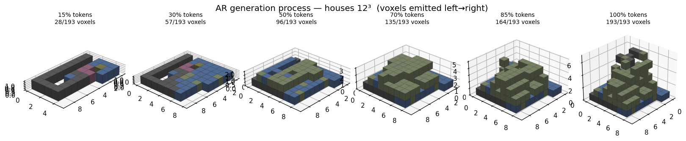

# BlockGen

**Text-free generative modeling of structured / constrained 3D block data.**

BlockGen learns to *generate new, plausible 3D structures* — starting from Minecraft
voxel builds — and to **prove the outputs are novel** (not memorized) via
nearest-neighbor comparison. The design is intentionally medium-agnostic: the same
representation + evaluation pipeline is meant to carry over to **LEGO** models and
**electronics** schematics (see the [Roadmap](roadmap.md)).

## What's here

- Three generative **tracks** over one shared representation
  ([Models](models.md)): an autoregressive token transformer (A), a masked discrete
  diffusion 3D-UNet (B), and a graph latent VAE (C).
- A **novelty evaluation** shared by all tracks (occupancy-IoU nearest neighbors,
  duplicate rate, diversity, validity).
- A **metadata-driven curation** tool that carves the noisy scraped dataset into clean,
  coherent subsets (houses, pixel art, …) and *preserves* material/color variants
  ([Data & curation](data-and-curation.md)).
- Reproducible **experiment runners** that emit figures, samples, metrics, and configs
  under `outputs/` ([Experiments](experiments.md)).

## Headline results so far

| Finding | Evidence |
|---|---|
| Diffusion learns a dense build *type* (houses) without memorizing | NN-IoU ≈ 0.48, duplicate-rate 0 |
| **AR is the best house generator** once scale-normalized | NN-IoU **0.568** vs diffusion 0.369 on identical 12³ houses |
| MaskGIT under-fills a well-trained net; **flow matching** holds density | occ 96 vs 1017 (target 1086), same weights |
| Flat token embeddings **don't** learn birch≈oak | within-family cos-sim ≈ random baseline |

See [Results](results.md) for the full tables and figures.

/// caption
The AR model generates a house **bottom-up**: foundation → walls → pitched roof.
///

## The core challenge: variable size / footprint

Real builds vary wildly in size, which breaks fixed-shape models. BlockGen always
`crop_to_non_air()` first, then handles size per track — EOS-terminated token streams
(A), a fixed canonical grid (B), or size-agnostic graphs (C) — and uses **scale
normalization** (downsample to a canonical grid) to bring dense builds into range of the
token tracks. This is discussed in [Representations](representations.md).
