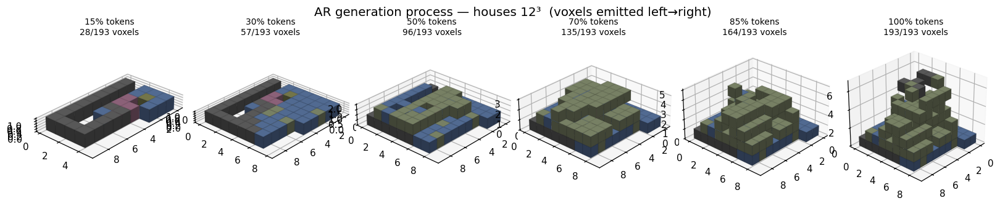

# BlockGen

**Text-free generative modeling of structured / constrained 3D block data.**

BlockGen learns to *generate new, plausible 3D structures* — starting from Minecraft
voxel builds — and to **prove the outputs are novel** (not memorized) via
nearest-neighbor comparison. The design is intentionally medium-agnostic: the same
representation + evaluation pipeline is meant to carry over to **LEGO** models and
**electronics** schematics (see the [Roadmap](roadmap.md)).

## What's here

- Three generative **tracks** over one shared representation
  ([Models](models.md)): an autoregressive token transformer (A), a masked discrete
  diffusion 3D-UNet (B), and a graph latent VAE (C).
- A **novelty evaluation** shared by all tracks (occupancy-IoU nearest neighbors,
  duplicate rate, diversity, validity).
- A **metadata-driven curation** tool that carves the noisy scraped dataset into clean,
  coherent subsets (houses, pixel art, …) and *preserves* material/color variants
  ([Data & curation](data-and-curation.md)).
- Reproducible **experiment runners** that emit figures, samples, metrics, and configs
  under `outputs/` ([Experiments](experiments.md)).
- A **LegoACE port** (91.7M GPT-2 over native 4-token block records, vendored in
  `libs/MinecraftACE`) with a full export → train → sample → render/eval loop
  ([MinecraftACE](minecraftace.md)).
- An **auto-labeling pipeline** — 4-view renders → VLM + template captions → frozen
  DINOv2/CLIP embeddings — feeding image/text-conditioned generation
  ([Labeling & captions](labeling.md)).
- An **agentic track** (E): a frontier LLM writes a short WorldEdit-style *build
  program* that is executed onto a voxel canvas — no training, arbitrary canvas
  sizes, free text/image conditioning, and builds an order of magnitude larger than
  the per-voxel tracks reach ([Agentic generation](agentic.md)).
- A **pick-and-place track** (F): a *picker* chooses the block and a *placer*
  chooses which open face of the partial build to attach it to, so connectivity
  is guaranteed by the representation and geometry enters as a relative-offset
  attention bias rather than a positional encoding
  ([Pick-and-place](pick-and-place.md)).
- A whole-codebase operator's map — every package, model class (incl. the phase4 PE),
  trainer, and the write-your-own-experiment pattern ([Architecture](architecture.md)),
  plus a runnable end-to-end walkthrough for adding your own architecture
  ([Bring your own model](custom-model.md)).
- A **validated cross-track benchmark** — every metric must pass a corruption
  ladder before it is allowed to rank anything, and realism is always reported
  beside novelty so a memorizing model cannot win ([Evaluation suite](benchmark.md)).
- **BlockLab**, an always-on local app for the half of the work a printed table
  cannot do: browsing corpora, keyboard triage, 2AFC comparison, tuning curation
  gates, and reading a run or the cross-run board with the actual builds beside
  the numbers ([BlockLab](lab.md)).

## Start here

New to the repo? [Getting started](getting-started.md) sets up the environment and
the data caches, then **[Workflow](workflow.md)** walks the path everything else
assumes — train a model, sample it to an evaluation arm, score it against controls
and baselines, and look at the result in BlockLab. It also says which parts are
optional, because most of them are: an arm is just a cache of structures, and
procedural generators, LLM-written programs and hand-built sets all enter the
pipeline on equal terms.

## Headline results so far

| Finding | Evidence |
|---|---|
| **Adjacency-constrained decoding gives validity 1.0** by construction, ~quality-neutral | T11 `ar_raster_constrained` |
| **Category conditioning is the best cohesion lever** | T10 — top val_nn + raw validity |
| **AR is the best house generator**; best arm = 84% of the real-build baseline, zero duplicates | val_nn 0.405 (T11) |
| **No cross-medium transfer gain** in the data-rich regime — compression ≠ generation | T12 — finetune ≈ scratch |
| 3D-BPE cluster tokens = anti-memorization (dup 0 where flat memorizes) | T10 vehicles |
| Flat token embeddings **don't** learn birch≈oak | within-family cos-sim ≈ random baseline |
| **Growth gives validity 1.0 without constrained decoding**; placer runs 139× its legal-face chance baseline | T24 — pick-and-place |
| **Programs beat per-voxel tokens for scale**: 1,070-block coherent house, 0 failed commands, $0.008 | T22 — agentic track (`gpt-5-mini`) |
| **Render-space realism is structurally blind**: deleting every interior in the corpus is not separable from real | T25 — `solidify` shares a group with `real_test` on MV-DINO-KID |
| **`geom_kid` sees it at 202 real-sample spreads**, needs no GPU, and is exactly invariant to yaw and to material | T25 — validated on the same ladder |

See [Results](results.md) for the full tables and figures, and
[Data & curation](data-and-curation.md) for all five Minecraft corpora plus the LEGO
corpora (OMR / StableText2Brick / LDraw / shadow) now fetched for the next phase.

/// caption
The AR model generates a house **bottom-up**: foundation → walls → pitched roof.
///

## The core challenge: variable size / footprint

Real builds vary wildly in size, which breaks fixed-shape models. BlockGen always
`crop_to_non_air()` first, then handles size per track — EOS-terminated token streams
(A), a fixed canonical grid (B), size-agnostic graphs (C), or a `STOP`-terminated
attachment stream (F) — and uses **scale
normalization** (downsample to a canonical grid) to bring dense builds into range of the
token tracks. This is discussed in [Representations](representations.md).
