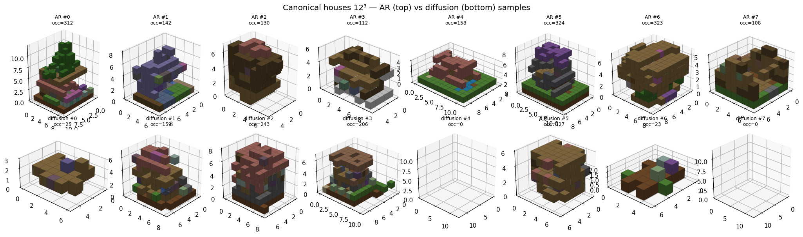

# Models — the three tracks

All three share the tokenizer and the novelty eval. No text conditioning.

## Track A — Autoregressive token transformer

`blockgen/models/voxel_transformer_ar.py` · train `blockgen/training/train_ar.py`

A causal transformer over the `[BOS,(X,Y,Z,BLOCK)*,EOS]` stream (LegoGPT-aligned).
Variable size is intrinsic (EOS terminates). Generation is a **bottom-up build** thanks to
the `(y,z,x)` raster order.

- **Strengths:** best house generator once scale-normalized (NN-IoU 0.568); the spatial
  autoregression is a good building prior; the most transferable token format for LEGO
  pieces / circuit components.
- **Limits:** sequence length grows with block count (`seq ≈ 4·n_blocks`), so dense builds
  need scale normalization; samples can fragment (no connectivity constraint yet).

/// caption
Canonical 12³ houses: AR (top) makes consistent houses; diffusion (bottom) is mixed
(some blobs, some empty).
///

## Track B — Masked discrete diffusion (3D-UNet)

`blockgen/models/voxel_diffusion.py` · train `blockgen/training/train_diffusion.py`

A compact 3D-UNet over the `grid³` class volume, trained MaskGIT/D3PM-style: mask a
fraction of voxels, predict them with cross-entropy (air down-weighted). Two samplers on
the same trained net:

- **`sample_grids`** — MaskGIT: commit the most *confident* voxels first (confidence via
  Gumbel-perturbed log-probs).
- **`sample_grids_flow`** — discrete **flow matching**: reveal voxels at the linear-schedule
  rate `1/(steps−step)` and fill with a fresh sample.

!!! warning "MaskGIT under-fills a well-trained net"
    Once the model is sharp, air is its most-confident class, so MaskGIT commits air and
    dumps a blob at the final step (occ 96 vs target 1086). Flow matching reveals uniformly
    and holds density (occ 1017). Each sampler needs its **own** `air_bias`
    (flow ≈ −2, MaskGIT ≈ +1). Diffusion handles dense builds the token tracks can't ingest.

## Track C — Graph latent VAE

`blockgen/models/large_pyg_graph_generator.py` · train `blockgen/training/train_graph.py`

TransformerConv encoder over the block+port graph → Gaussian latent → GRU token decoder
(+ a `size_head`). Trained as a VAE (reconstruction CE + KL). Size-agnostic, and the graph
form maps directly to LEGO studs / netlists — the highest-transfer track.

## Evaluation — `blockgen/eval/novelty.py`

Everything is voxelized to a canonical grid and compared by occupancy IoU:

- **`mean_nn_iou`** — mean best IoU to the training set (low ⇒ novel; ~1.0 ⇒ memorized).
- **`duplicate_rate`** — fraction with NN-IoU ≥ 0.95.
- **`diversity`** — 1 − mean pairwise IoU among samples.
- **`validity_rate`** — fraction that are a single connected component.
- **`mean_block_agreement`** — class agreement with the nearest neighbor.

`render_comparison_grid` draws each sample beside its top-k nearest training neighbors —
the visual novelty proof.
