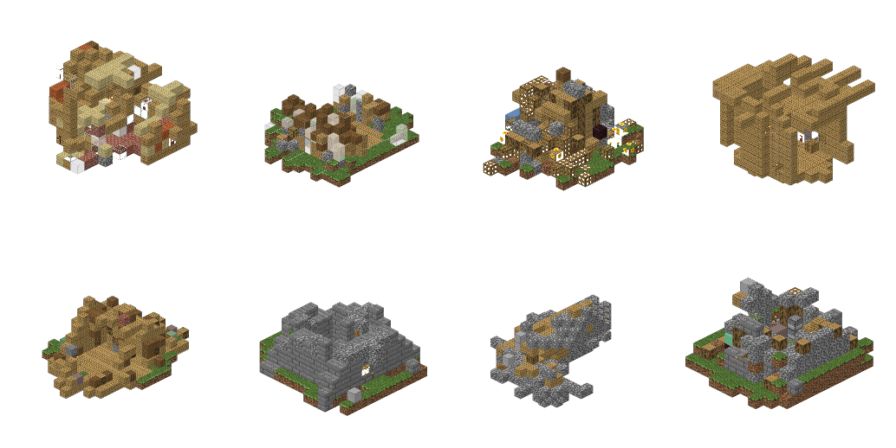

# Pick-and-place (Track F) — learned growth

`blockgen/models/pick_n_place.py` · `blockgen/training/train_pick_n_place.py` ·
`blockgen/utils/growth_order.py` · run `scripts/train_pick_n_place.py`

Every other track answers *"what is the next token"* and gets geometry as a side
effect. This one splits the question in two and makes both learned:

$$
\textbf{Picker: } G \to P(V)
\qquad\qquad
\textbf{Placer: } G \times V \to P(E)
$$

A build grows one voxel at a time. At each step the **picker** chooses a block
from the palette (or `STOP`), and the **placer** chooses which of the currently
**open faces** to attach it to. Both read the same encoding of the partially
built structure.

!!! note "Why this exists"
    T21 ran the same growth process with placement *implicit* — a hand-written
    frontier heap decided where each piece went and the model only chose the
    piece. It failed with a specific diagnosis: the model learned op frequencies
    but *could not read its own history as geometry*, closing the frontier down
    harder the more real structure it was handed (close-rate 0.693 → 0.838 →
    0.896 against a flat ground truth of 0.606). `implementation_plan.md` §3
    concluded that a state encoder over the placed structure is a
    **prerequisite**, not a capacity upgrade. This module is that encoder plus a
    head that makes *where* a learned decision.



/// caption
`pnp_384` samples, real-texture render. Single-component by construction and
locally plausible material runs — but every one of them ran to the 384-node cap
rather than deciding it was finished, which is [P2](#p2-the-cap-truncates-86-of-the-corpus-and-starves-stop).
///

---

## 1. The paradigm

| | Track A (AR tokens) | Track F (pick-and-place) |
|---|---|---|
| unit of a step | one of `X`,`Y`,`Z`,`BLOCK` | one placed voxel |
| how position is stated | absolute coordinate tokens | a face of an already-placed voxel |
| connectivity | not guaranteed (needs constrained decoding) | **guaranteed by construction** |
| stream length | `≈ 4 · n_blocks` | `n_blocks` |
| what "position" means to the net | a token id | a learned bias on the *relative offset* between nodes |

The defining property is the third row. A growth sequence **cannot** produce a
disconnected build, because every node after the seed is defined as a neighbour
of an existing node. Validity is not a metric to optimise here; it is 1.0 by
construction, the same guarantee `constrained_decode.py` buys Track A at
decode time, obtained instead from the representation.

---

## 2. The representation — `GrowthSequence`

`blockgen/utils/growth_order.py` turns a `Structure` into an ordered list of
placements. For a build with `N` voxels:

| field | shape | meaning |
|---|---|---|
| `pieces` | `[N]` | which block, as a packed token |
| `parent` | `[N]` | index of the earlier node it attached to (`-1` for the seed) |
| `direction` | `[N]` | which of the 6 faces it arrived through (`-1` for the seed) |
| `coords` | `[N,3]` | absolute lattice position (derived, see below) |
| `neighbor_node` | `[N,6]` | node index that eventually occupies each neighbouring cell, `-1` if never |

**The seed** is the lowest, then most central voxel — a deterministic anchor a
decoder can reproduce. **The order** is a frontier traversal: `bfs` (default),
`dfs`, or `layered`. Only the largest 6-connected component is kept; on
`houses_32` that retains **99.95%** of blocks.

`coords` is *derived*, not authoritative. `growth_to_structure` replays a
sequence by walking `parent`/`direction` from the seed and **never reads
`coords`** — so a mismatch between the two shows up as a broken round-trip
rather than silently working in training and failing at sampling.

```
mean_roundtrip_iou = 1.000     min_roundtrip_iou = 1.000     (100 builds)
```

That is the Phase-0 gate. It passes exactly, on every build.

---

## 3. Are the elements tokenized? Yes — and there is no air token

**Yes.** `PieceCodec` maps each distinct block to a contiguous model id. A piece
token is `block_id`, or `block_id*16 + block_data` when `--oriented` is set (so
stair and log rotations become separate atoms). The palette is built by frequency
from the training split and capped by `--vocab-limit`; on `houses_32` it lands at
**229 pieces**.

Three ids are structural:

| id | name | role |
|---|---|---|
| `0` | `STOP` | the build is finished. The **only** terminator. |
| `1` | `PAD` | batch padding. Forced to `-inf` in the picker — never selectable. |
| `≥2` | pieces | the palette, offset by `PIECE_OFFSET = 2` |

**There is no `NO_BLOCK` / air token, and by construction there cannot be one.**
Air is the *absence* of a node, exactly as in the Track A token stream. A face
that is never chosen simply stays open forever and becomes exterior surface. So
"leave this face empty" is not a decision the model ever makes — it is the
default, and the only way the model expresses "done" is the global `STOP`.

That has a consequence worth being explicit about, because it is where the
measured failures live: **all termination pressure is carried by one token,
predicted from one state vector, once per step.** The picker must aggregate
"is this house finished?" over the whole graph at every single placement. See
[§8 P2](#p2-the-cap-truncates-86-of-the-corpus-and-starves-stop).

!!! question "Should we start with a simpler single-block generator and placer?"
    **We already are.** Every node is exactly one voxel — there are no multi-voxel
    pieces, no shapes, no orientation-aware docking. `V` is a vocabulary of block
    *materials*, not of parts. Multi-voxel pieces are what 3D-BPE cluster tokens
    do on Track A, and they are not in this model.

    The genuinely simpler variant still available is to collapse the palette to
    **one material** (`|V| = 1`). Then the picker becomes trivial, `STOP` is its
    only real decision, and every bit of remaining loss is the placer's. That
    isolates the geometry head completely and is the cleanest way to find out
    whether §8 P1 is what is holding `place_acc` down. It is a one-flag change
    and has not been run.

---

## 4. Architecture

### 4.1 The encoder — connection features, not positional encoding

```python
x_i = E_piece(v_i) + E_dir(d_i) + E_parent(v_parent(i)) + W·[ i/max_nodes , y_i/32 ]
```

A node's input features say **what it is and how it joined**: its own piece, the
face direction it arrived through, and its parent's piece. Nothing about the
future — encoding a node's *final* 6-neighbourhood here would leak nodes placed
later, inflate every training number, and do nothing at sampling time.

!!! danger "The step feature must be normalised by a constant"
    `i / max_nodes`, never `i / N`. Dividing by the current sequence length makes
    the feature mean different things in training (where `N` is the padded batch
    max) and in generation (where `N` is however far we have got). Measured: the
    model learned "STOP when the feature reaches 1.0" and generated a **median of
    30 blocks** against training sequences that were all exactly 192 long. Fixing
    the denominator moved the median from 30 → 187 while val `place_acc` moved
    only 0.715 → 0.713. Pinned by `test_prefix_features_match_full_sequence`.

### 4.2 Relative geometry bias — where the graph enters

Geometry is not a feature; it is an **additive per-head attention bias** on the
relative 3D offset between every pair of nodes:

```python
bias[h, i, j] = B[h, clamp(c_i - c_j, ±r)]        # r = rel_clamp, default 4
```

`B` is a learned table with `(2r+1)³ = 729` entries per head, initialised to
zero. An *edge* is just the special case where the offset is one of the six unit
vectors — so the same table covers "adjacent", "two apart", "diagonal", and "far"
without ever enumerating an edge list. This is the "connection embedding" doing
the job absolute position does in a text transformer, and it is the specific
mechanism intended to fix T21's blindness: the model cannot avoid seeing the
geometry, because the geometry is *in the attention*.

Offsets are clamped because locality is the point — two nodes 30 voxels apart do
not need their exact separation, and clamping keeps the table finite.

### 4.3 Picker — a plain LM head

Two-layer MLP over the state → `vocab_size` logits, with `PAD` forced to `-inf`.
Nothing exotic; this is a next-token head over the palette plus `STOP`.

### 4.4 Placer — a pointer network, not an N² map

Scoring every ordered pair of nodes would be wasteful and mostly illegal. The
candidate set is the **open faces**, at most `6N`:

```python
q_t     = MLP_q([ state_t ; E(piece_t) ])         # what am I placing, into what
k_{i,d} = MLP_k([ node_state_i ; E_dir(d) ])      # this face of that node
logits  = ⟨q_t, k_{i,d}⟩ / √d
logits  = logits.masked_fill(~legal, -inf)        # BEFORE the softmax
```

Two deliberate choices:

- **The query carries the piece.** This is what makes it `G × V → P(E)` rather
  than two independent heads — where a block goes depends on what it is.
- **Masking happens before the softmax, not after.** Renormalising a
  post-softmax distribution is numerically worse *and* makes the cross-entropy
  target inconsistent with the distribution actually sampled from. Answering the
  original design question directly: mask the **logits**, never the
  probabilities.

The mask arrives as an **argument**, not as internal state, because legality is a
property of the world rather than the network. The same head works unchanged for
a bounded canvas, a collision rule, or a piece-specific docking rule.

---

## 5. Input / output contract

Teacher-forced forward pass, batch `B`, padded length `N`:

| in | shape | dtype | |
|---|---|---|---|
| `pieces` | `[B,N]` | int64 | model piece ids, `PAD` in the padding |
| `direction` | `[B,N]` | int64 | `0..5`; `6` = seed / padding |
| `parent_piece` | `[B,N]` | int64 | the parent's piece, `PAD` for the seed |
| `coords` | `[B,N,3]` | int64 | absolute lattice coords |
| `legal` | `[B,N,N,6]` | bool | row `t` = faces available when placing node `t` |
| `pad_mask` | `[B,N]` | bool | `True` = padding |

| out | shape | |
|---|---|---|
| `pick_logits` | `[B,N+1,V]` | one prediction per node, **plus** the final `STOP` |
| `place_logits` | `[B,N,N*6]` | flattened `parent*6 + direction`, `-inf` on illegal |

| target | shape | |
|---|---|---|
| `pick_target` | `[B,N+1]` | the pieces, then `STOP` — `-100` where ignored |
| `place_target` | `[B,N]` | `parent*6 + direction`; row 0 (the seed) is `-100` |

The encoder returns `[B,N+1,D]`: index `t` is the state **with nodes `0..t-1`
placed**, so state `0` is the empty graph (a learned `BOS`) and state `t` is what
the model sees when deciding node `t`. Keeping the index on *who is being placed*
rather than *how many are placed* is what removes the off-by-one that would
otherwise let a node attach to itself.

!!! warning "`legal` is why `max_nodes` exists"
    `legal` is `B·N²·6` bools and `place_logits` is `6BN²` floats. At `B=4,
    N=384` that is 14 MB of logits — fine. At `N=1069` (the corpus median) it is
    110 MB before the backward pass, and at `N=2611` (p90) it is 654 MB. This
    single tensor is the reason the cap is 384 rather than "the whole build".

---

## 6. Edge faces and connections — how legality is actually computed

There are **two** implementations, and they must agree exactly or training and
sampling are solving different problems.

**Training (`GrowthSequence.placement_masks`) — vectorised, precomputed.** The
final structure is known, so `neighbor_node[i,d]` stores the index of whichever
node *eventually* occupies that cell. A cell is occupied at step `t` exactly when
its eventual occupant's index is `< t`, which collapses the whole time-varying
mask to a comparison:

```python
legal[t, i, d]  =  (i < t)  and  not (0 <= neighbor_node[i, d] < t)
#                  parent          target cell not yet filled
#                  already
#                  placed
```

No per-step set membership, no Python loop, all `N` steps at once.

**Sampling (`live_legality`) — from the world as actually built.** There is no
future to consult, so it hashes the placed coordinates and tests each face
directly. It also applies `--max-extent`, refusing any face that would push the
bounding box past the canvas.

The two definitions coincide by construction: *"parent placed, target cell
empty"*. The precomputed version is an optimisation of the live one, not a
different rule.

---

## 7. Training

One encoder pass per build, causal, all steps supervised in parallel — the
teacher-forcing shortcut from `implementation_plan.md` §3. Two cross-entropies:

```
L  =  CE(pick_logits, pick_target)  +  λ · CE(place_logits, place_target)
```

with `λ = --place-weight` (default 1.0) and `ignore_index=-100` handling both
edges: the **seed** has a pick target and no place target, the **final step** has
a `STOP` target and no place target.

**`STOP` is supervised only on builds that ended on their own.** A sequence that
hit `max_nodes` was cut mid-build, so its last step is not an ending; teaching
`STOP` there teaches "stop at the cap" instead of "stop when the house is
finished". Truncated builds therefore get no `STOP` target at all
(`item["complete"]` gates it). `--complete-only` goes further and drops truncated
builds from the dataset entirely.

**Read `place_lift`, not `place_acc`.** The placer chooses among *legal* faces, so
the mask has already done much of the work and raw accuracy has a floor set by
the mask rather than by zero. `place_lift = place_acc / (1/n_legal)` is the
honest number. A lift near 1.0 means the model learned nothing the mask did not
already provide — the distinction that forced T21's headline numbers to be
retracted.

### Running it

```bash
.venv/bin/python scripts/train_pick_n_place.py --quick               # ~2 min smoke
.venv/bin/python scripts/train_pick_n_place.py --epochs 40 --max-nodes 384
.venv/bin/python scripts/train_pick_n_place.py --epochs 40 --max-nodes 384 --complete-only
```

One command produces the whole run directory: checkpoint, palette, metrics,
a textured `samples.png`, and an `.npz` structure cache ready for the
[benchmark](benchmark.md):

```bash
python -m blockgen.eval.bench --arm outputs/run_..._pnp/pnp_32.npz
.venv/bin/python scripts/pnp_prefix_test.py --run outputs/run_..._pnp
```

---

## 8. Evaluating the formulation — what is actually wrong

Everything below is measured, not suspected. Ordered by how much it distorts the
numbers.

### P1. The placer's label is not identifiable

Several open faces can point at the **same empty cell**. Placing block `v` at
cell `c` from parent `A` or from parent `B` produces a byte-identical structure,
but cross-entropy names one of them correct and scores the rest as errors.
Measured over 56,223 real placements:

| faces aiming at the target cell | share |
|---|---|
| 1 | 19.8% |
| 2 | **61.6%** |
| 3 | 18.2% |
| ≥4 | 0.4% |

Mean multiplicity **1.99**. A model that correctly treats tied faces as
equivalent and breaks the tie at random tops out at **`place_acc` = 0.568**.

The measured val `place_acc` is **0.729** — *above* that ceiling. Which means the
model is not just learning geometry; it has learned to reproduce **BFS's
tie-break convention**, an artifact of how `structure_to_growth` happened to
serialise the build. Part of the headline accuracy is measuring the encoder, not
the houses.

**The fix is small.** Marginalise the loss over cells instead of faces: group the
face logits by the cell they point at and `logsumexp` within each group, then take
cross-entropy over cells. See [§9](#the-identifiable-alternative). This also
makes `place_acc` comparable across orderings, which it currently is not.

### P2. The cap truncates 86% of the corpus, and starves `STOP`

Measured on 400 real training builds with **no cap**:

| | p50 | p90 | max |
|---|---|---|---|
| nodes per build | 1,069 | 2,611 | 7,673 |
| open faces at the end | 1,980 | 4,980 | 9,072 |

Against `max_nodes = 384`, only **13.8%** of builds finish on their own
(`complete_frac`). Two consequences:

1. **`STOP` has almost no signal.** At `complete_frac = 0.138`, `STOP` is 0.036%
   of all pick targets. Measured outcome: the model emitted it **0.00** of the
   time and every sample ran to the cap.
2. **Every realism number is confounded with size.** The benchmark compares
   384-block fragments against ~1,000-block houses. `pick_n_place` scores
   `mv_dino_kid` **0.532** — the worst arm in the table — and that figure cannot
   be separated from truncation until the cap is lifted.

The cap is not a hyperparameter choice; it is forced by the `[B,N,N,6]` tensor in
[§5](#5-input-output-contract). **This is the root cause of P2 and P3 both.**

### P3. Neither training set produces a model that reads build length

`scripts/pnp_prefix_test.py` teacher-forces the first *K* nodes of a real
held-out build and lets the model continue. The headline is `cont_ratio` — how
far the model continues as a fraction of how far the real build actually goes
from that point — and `length_corr`, the correlation between the two across
builds. `length_corr` is the part a fixed-output model cannot fake.

Same architecture, same hyperparameters; only the data filter differs:

| trained on | `abs(cont_ratio − 1)` across prefixes | `length_corr` | reading |
|---|---|---|---|
| all builds (86% truncated), n=16 | 0.237 → 0.272 → 0.418 (**grows**) | −0.05 | error grows with more real prefix |
| `--complete-only` (258 builds), n=24 | 0.169 → 0.105 → 0.129 (flat) | −0.02 | error stops growing; length still unread |

`--complete-only` removes the **blindness signature** — the error no longer grows
the more real structure the model is handed, which is precisely what T21 measured
and what this diagnostic exists to detect. It does **not** buy the positive
result: `length_corr ≈ 0` in both, so neither model continues further for builds
that genuinely had further to go. Both emit a roughly fixed budget.

!!! warning "This correction is itself the lesson"
    An earlier run of this same test at **n = 12** read `0.213 → 0.103` and
    scored `USES THE PREFIX`. Doubling to n = 24 moved it to `0.169 → 0.129` and
    the verdict to `NOT BLIND BUT NOT READING LENGTH`. The optimistic reading did
    not survive the larger sample. Do not quote this diagnostic below n ≈ 24, and
    prefer `length_corr` to `cont_ratio` — it is the statistic that stayed stable.

`--complete-only` is also expensive: it keeps 258 of 1,863 builds and val
`place_acc` collapses 0.729 → 0.340. Neither configuration is acceptable, which
is the same conclusion as P2 from a different direction.

### P4. `pick_acc` is reported without a baseline

`place_acc` is reported against its chance floor; `pick_acc` is reported bare, so
"0.607" is unreadable on its own. Computing the missing baseline on the val split
(143,356 nodes, 190 distinct pieces):

| | value |
|---|---|
| always guess the most common block | 0.189 |
| **measured `pick_acc`** | **0.607** (3.2× the baseline) |
| unigram entropy (a frequency-only picker's loss) | 3.717 nats |
| **measured `pick_loss`** | **1.578** |

The picker is genuinely learning. This is good news that was previously
unquotable, and `evaluate()` should emit both baselines the way it emits
`place_chance`.

### P5. The height feature assumes the seed is the lowest node

`node_features` uses **absolute** `y/32`. In training, coordinates come from a
cropped structure and the seed is chosen as the lowest voxel, so `y` means
"height above the ground". In generation the seed is placed at the origin and
everything is seed-relative, so nothing prevents the model from growing downward
into **negative `y`, which it never saw in training**. Not yet measured; the
check is one line over the rollouts.

### P6. Generation is O(N³)

`generate` re-encodes the entire graph from scratch at every step — honest
O(N²) per step, O(N³) per build. Tolerable at `N = 384`; roughly 20× worse at the
corpus median. Cached incremental message passing is the fix and is deliberately
not done (`implementation_plan.md` §3).

### Not a bug, but worth knowing

- **The direction embedding has no group structure.** `E_dir` is six independent
  atoms, so a rotated house is an entirely unrelated token sequence to this
  model. There is no rotation equivariance anywhere in the architecture.
- **Translation:** the attention bias depends only on `c_i − c_j`, so the model
  *is* translation-equivariant — except in `y`, which the height feature breaks
  deliberately, because houses have a ground.

### Where it stands

| arm | n | MV-DINO-KID ↓ | interior ratio | blocks |
|---|---|---|---|---|
| real (test) | 128 | −0.001 | 0.106 | 1003 |
| agentic (Track E) | 12 | 0.107 | 0.021 | 1699 |
| native AR, oriented | 64 | 0.192 | 0.005 | 1082 |
| **pick_n_place** | 16 | **0.532** | 0.000 | 185 |

Last, by a wide margin — but read P2 before reading that number, and note the
`n = 16`.

---

## 9. Formal statement

**State.** After `t` placements the world is
$S_t = \{(c_i, v_i)\}_{i<t}$ with lattice positions $c_i \in \mathbb{Z}^3$ and
pieces $v_i \in V$. Write $C_t = \{c_i : i < t\}$ for the occupied set and
$D = \{\pm e_x, \pm e_y, \pm e_z\}$ for the six unit directions, indexed
$d \in \{0,\dots,5\}$.

**Open faces.** The action space at step `t` is

$$
F(S_t) \;=\; \bigl\{ (i,d) \;:\; i < t,\;\; c_i + e_d \notin C_t \bigr\}
\;\subseteq\; \{0..t-1\} \times \{0..5\}
$$

with $|F(S_t)|$ equal to the surface area, in faces, of the partial build
(measured median 1,980 at completion). A face $(i,d)$ determines the new cell
through $\varphi(i,d) = c_i + e_d$.

**Factorisation.** A build of `T` voxels has likelihood

$$
p(S) \;=\; \underbrace{p_{\text{pick}}(v_0 \mid \varnothing)}_{\text{seed, no placement}}
\;\cdot\!\!\prod_{t=1}^{T-1}\!\!
\underbrace{p_{\text{pick}}(v_t \mid S_t)}_{\text{what}}
\cdot
\underbrace{p_{\text{place}}\bigl((i_t,d_t) \mid S_t, v_t\bigr)}_{\text{where}}
\;\cdot\;
\underbrace{p_{\text{pick}}(\texttt{STOP} \mid S_T)}_{\text{done}}
$$

and the transition is $c_t = c_{i_t} + e_{d_t}$, which is why the build is
connected by construction: every $c_t$ is 6-adjacent to some $c_{i_t}$ already
present.

**Encoding.** With $h_t \in \mathbb{R}^D$ the state before placing node `t`,

$$
x_i = E_v(v_i) + E_d(d_i) + E_v^{\text{par}}(v_{\pi(i)}) + W\!\begin{bmatrix} i/M \\ y_i/32 \end{bmatrix},
\qquad
h_{0..T} = \operatorname{Enc}(x_{0..T-1})
$$

$$
A^{(m)}_{ij} = \frac{\langle q^{(m)}_i, k^{(m)}_j\rangle}{\sqrt{D/H}}
\;+\; B^{(m)}\bigl[\operatorname{clamp}(c_i - c_j, \pm r)\bigr]
\;+\; \underbrace{(-\infty)\,\mathbb{1}[j > i]}_{\text{causal}}
$$

$B \in \mathbb{R}^{(2r+1)^3 \times H}$ is the relative-geometry table — the term
that replaces positional encoding, and the only place adjacency is represented.

**Heads.**

$$
p_{\text{pick}}(\cdot \mid S_t) = \operatorname{softmax}\bigl(W_2\,\sigma(W_1 h_t)\bigr)
\quad\text{over } V \cup \{\texttt{STOP}\},\quad \text{logit}[\texttt{PAD}] = -\infty
$$

$$
q_t = \mathrm{MLP}_q\bigl([\,h_t \,;\, E(v_t)\,]\bigr),
\qquad
k_{i,d} = \mathrm{MLP}_k\bigl([\,h_{i+1} \,;\, E_{\text{dir}}(d)\,]\bigr)
$$

$$
\ell_t(i,d) =
\begin{cases}
\dfrac{\langle q_t,\, k_{i,d}\rangle}{\sqrt{D}} & (i,d) \in F(S_t) \\[2mm]
-\infty & \text{otherwise}
\end{cases}
\qquad
p_{\text{place}} = \operatorname{softmax}_{(i,d)}\; \ell_t
$$

The $-\infty$ is applied to $\ell$, before the softmax — so the normalising
constant runs over legal faces only and the sampled distribution is exactly the
one the loss is computed against.

**Objective.**

$$
\mathcal{L} = -\sum_{t=0}^{T-1} \log p_{\text{pick}}(v_t \mid S_t)
\;-\; \mathbb{1}[\text{complete}] \log p_{\text{pick}}(\texttt{STOP} \mid S_T)
\;-\; \lambda \sum_{t=1}^{T-1} \log p_{\text{place}}\bigl((i_t,d_t) \mid S_t, v_t\bigr)
$$

The indicator is P2's `STOP` gate: a truncated build contributes no termination
term.

### The identifiable alternative

$\varphi$ is **not injective** — measured mean fibre size $|\varphi^{-1}(c)| =
1.99$, which is P1. The fix is to push the distribution forward through
$\varphi$ and train on cells:

$$
p_{\text{cell}}(c \mid S_t, v_t)
\;=\!\!\sum_{(i,d)\,\in\,\varphi^{-1}(c)\,\cap\,F(S_t)}\!\! p_{\text{place}}(i,d)
\qquad\Longrightarrow\qquad
\mathcal{L}_{\text{place}} = -\log p_{\text{cell}}(c_t \mid S_t, v_t)
$$

Implemented as a `logsumexp` over each fibre before the cross-entropy. The
policy is unchanged — the model still emits a face, and any face in the fibre
yields the same structure — but the *label* becomes well-defined, and
`place_acc` stops rewarding reproduction of the BFS tie-break.

### Cost, exactly

| quantity | per build | at `N` = 1,069 (corpus median) |
|---|---|---|
| sequence length | `N` | 1,069 |
| picker logits | `N × palette` | 245 K |
| `legal` mask | `6N²` bools | 6.9 M |
| placer logits | `6N²` floats | **27 MB** (110 MB at batch 4) |
| candidate faces actually legal | `≈ 2N` | ≈ 2,000 of 6,414 slots |
| generation | `O(N³)` | — |

The last two rows are the argument for a sparse or windowed candidate list: the
dense tensor scores `6N` faces of which only about `2N` are ever legal, and
under BFS the true parent is **never more than ~512 nodes back** (measured, 100%
of 60,305 placements), so `[B,N,N,6]` can become `[B,N,512,6]` with no loss of
reachable targets and linear rather than quadratic memory.
