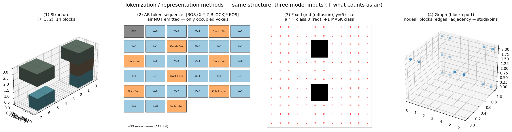
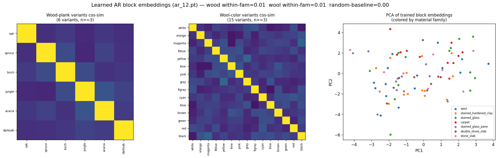

# Representations & tokenization

All three tracks read from one `Structure` (a cropped XYZ block volume) and one
`BlockVocab`, via `blockgen/utils/serialize.py`. There are **three representations**, and
a fourth proposed.



/// caption
The same structure as (1) a build, (2) an AR token stream, (3) a fixed grid, (4) a graph.
///

## 1. AR token sequence (Track A, and the graph decoder)

```
[BOS, X, Y, Z, BLOCK, X, Y, Z, BLOCK, ..., EOS]
```

Occupied voxels are emitted in `(y, z, x)` raster order — so generation proceeds
**bottom-up, layer by layer**. Variable size is handled entirely by the `EOS`
terminator; no fixed grid, no size prior. The unified vocab is:

```
[PAD, BOS, EOS]  +  max_dim coordinate tokens (shared x/y/z)  +  block-class tokens
```

Every emitted id is `< vocab.vocab_size` by construction (asserted) — this removed a CUDA
device-side assert during sampling.

## 2. Fixed canonical grid (Track B diffusion + all novelty eval)

Crop, then center-pad into a `grid³` array of class indices. Translation-tolerant, so it
doubles as the common representation for nearest-neighbor search.

## 3. Graph (Track C, and the transfer target)

The block+port PyG graph: nodes are blocks, edges are adjacency / ports. This maps
directly onto **LEGO stud connectivity** and **electronics netlists** — the reason Track C
is the most transferable (see [Roadmap](roadmap.md)).

## 4. (Proposed) delta-coordinate AR

Emit each voxel's coordinates *relative to the previous voxel* to shorten the AR stream
and bias toward locality — the planned way to let AR reach 16–24³ without the fidelity
loss of aggressive downsampling.

---

## Does air count as a token?

It depends on the representation — this is a real modeling choice:

| Representation | Is air a token/class? |
|---|---|
| **AR token sequence** | **No.** Only occupied voxels are emitted; air is the *absence* of a token. This keeps sequences short but means the model never explicitly "places air". |
| **Fixed grid (diffusion)** | **Yes.** Air is **class 0**, and there is an extra **MASK** class (the absorbing state). ~99% of grid cells are air, so the loss **down-weights the air class** (`air_weight ≈ 0.05`) and sampling uses a calibrated `air_bias` to control density. |
| **Graph** | **No.** Only blocks are nodes. |

## Do we have embeddings for tokens / voxels?

**Learned token embeddings: yes.** Each model has a trainable `nn.Embedding`
(AR `token_embedding`, diffusion class `embed`, graph block embedding). They are learned
from scratch per run — not pretrained, not structured.

**Structured "birch ≈ oak" voxel embeddings: no — and we measured that the flat ones do
not develop that structure.** Extracting the trained AR block embeddings and comparing
material variants:



/// caption
Wood-plank and wool-color variants are **near-orthogonal** (bright diagonal, dark
off-diagonal); within-family cosine similarity (≈0.006–0.008) sits at the random baseline
(≈0.002), and the PCA shows families fully intermixed.
///

So oak / spruce / birch (and the 16 wool colors) are treated as **independent atoms** —
the model does *not* know birch is like oak. This is the empirical motivation for
**factored embeddings** `E_family[id] + E_variant[data]`, so that all woods (and all
wools) share statistics and rare variants generalize. It's the top open idea; see
[Roadmap](roadmap.md#improving-generation-quality).
