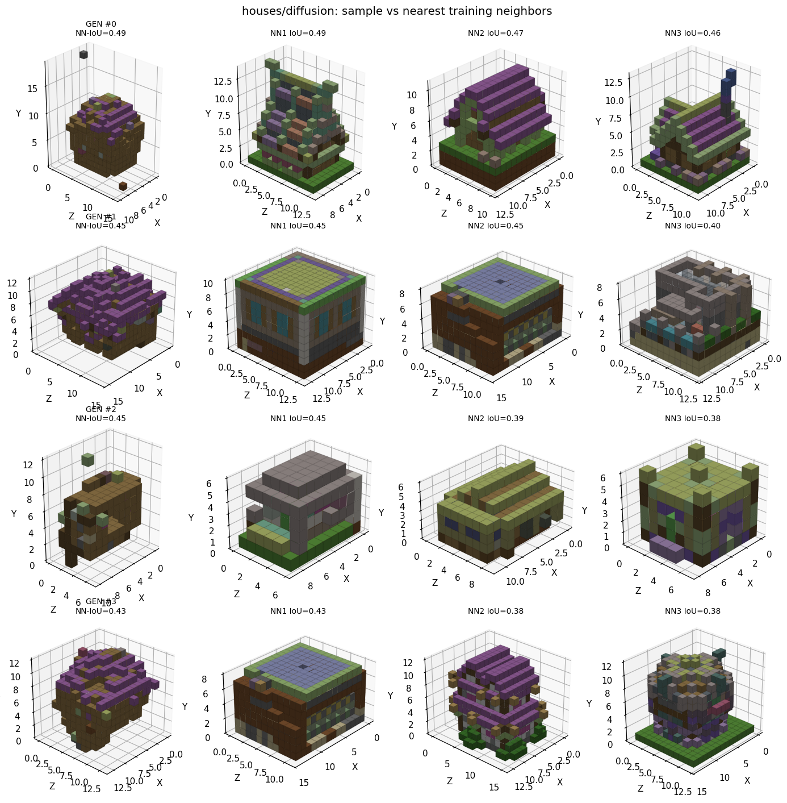

# Results

The authoritative, dated tables live in [`results.md`](https://github.com) at the repo
root (`results.md`) and the methods ledger in `notes.md`. This page summarizes the
headlines; regenerate everything with the [experiment runners](experiments.md).

## Curated-subset retraining (run `20260630_220830`)

Each model evaluated against the subset it trained on (`dup_rate = 0` everywhere ⇒ no
memorization).

| (subset) track | NN-IoU | dup | diversity | validity |
|---|--:|--:|--:|--:|
| (houses) diffusion | **0.483** | 0.00 | 0.713 | 0.250 |
| (pixel_art) AR | 0.406 | 0.00 | 0.898 | 0.062 |
| (redstone) AR | 0.392 | 0.00 | 0.877 | 0.062 |
| (pixel_art) diffusion | 0.101 | 0.00 | 0.991 | 0.000 |
| (pixel_art) graph | 0.107 | 0.00 | 0.972 | 0.125 |

/// caption
Generated house gestalts (left) vs distinct real houses (NN-IoU 0.38–0.49) — novel, not
memorized.
///

## GrabCraft medieval-houses — best models (run `20260701_053401_grabcraft`)

The cleaner, category-labeled dataset markedly improves AR.

| model | NN-IoU ↑ | dup ↓ | validity | blk-agree |
|---|--:|--:|--:|--:|
| **AR (canonical 12³)** | **0.727** | **0.312** ⚠ | 0.25 | **0.483** |
| diffusion-24 MaskGIT | 0.46 | 0.00 | 0.312 | 0.035 |

→ AR makes crisp, palette-correct medieval houses (grass → wood → purple roof) — our best
generation yet — **but memorizes ~31%** (some samples are verbatim copies). Diffusion is
the novelty-safe complement (0% duplicates, blobbier). Mitigations: dedup training set,
val-split novelty eval, higher resolution. See `outputs/run_20260701_053401_grabcraft/`.

## AR vs diffusion on canonical 12³ houses (run `20260630_232913_gen`)

| model | NN-IoU ↑ | validity | occ (target 185) | loss |
|---|--:|--:|--:|--:|
| **AR** | **0.568** | 0.375 | 165 | 0.114 |
| diffusion | 0.369 | 0.375 | 60 (under-fills) | 0.254 |

→ **AR wins on houses** once scale-normalized.

## Diffusion sampler study (same trained 24³ net)

| sampler | NN-IoU | median occ (target 1086) |
|---|--:|--:|
| MaskGIT | 0.266 | 96 — under-fills |
| flow matching | 0.228 | 1017 — holds density |

## Embeddings

Flat learned block embeddings do **not** develop family structure: wood/wool within-family
cosine similarity (≈0.006–0.008) ≈ random baseline (≈0.002). See
[Representations](representations.md#do-we-have-embeddings-for-tokens-voxels).

## Known limitations

- **Validity ≤ ~0.38** — samples fragment; a connectivity/stability **validity gate** is
  the top quality lever.
- **Block-class agreement low** — shape is learned, exact materials are interchanged →
  factored embeddings.
- Single-run numbers; occupancy is sampling-sensitive.
