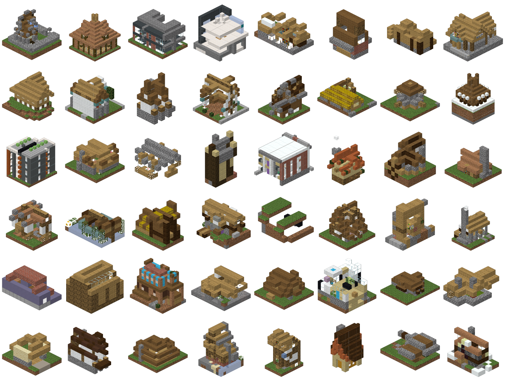
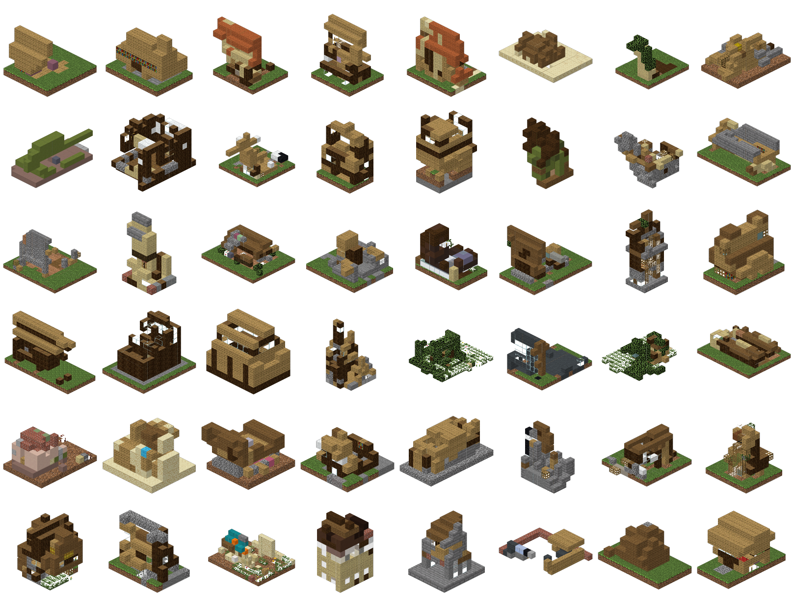
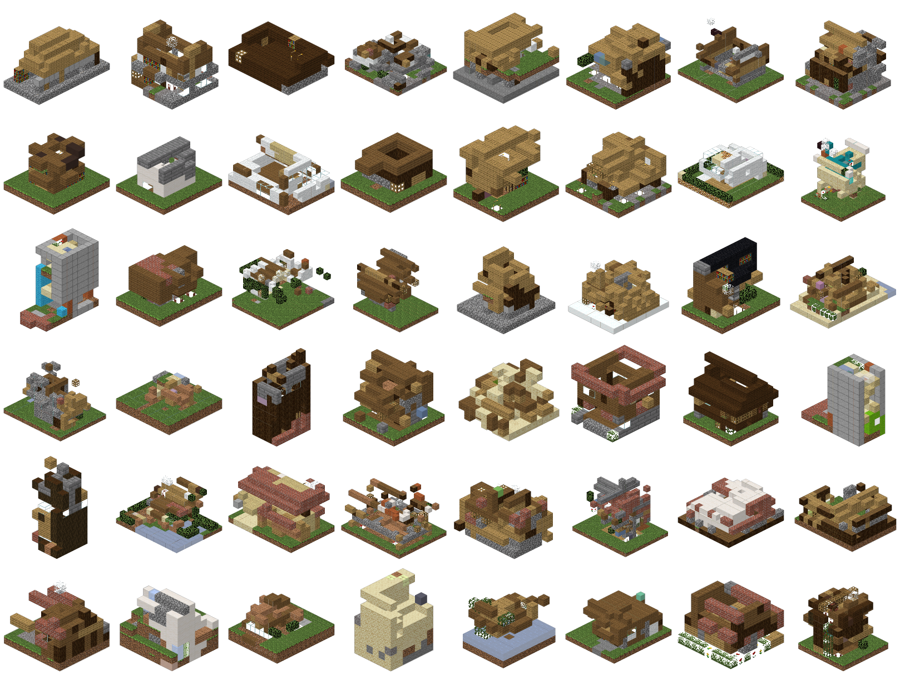
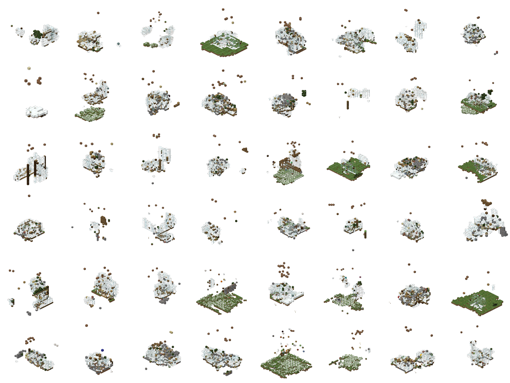
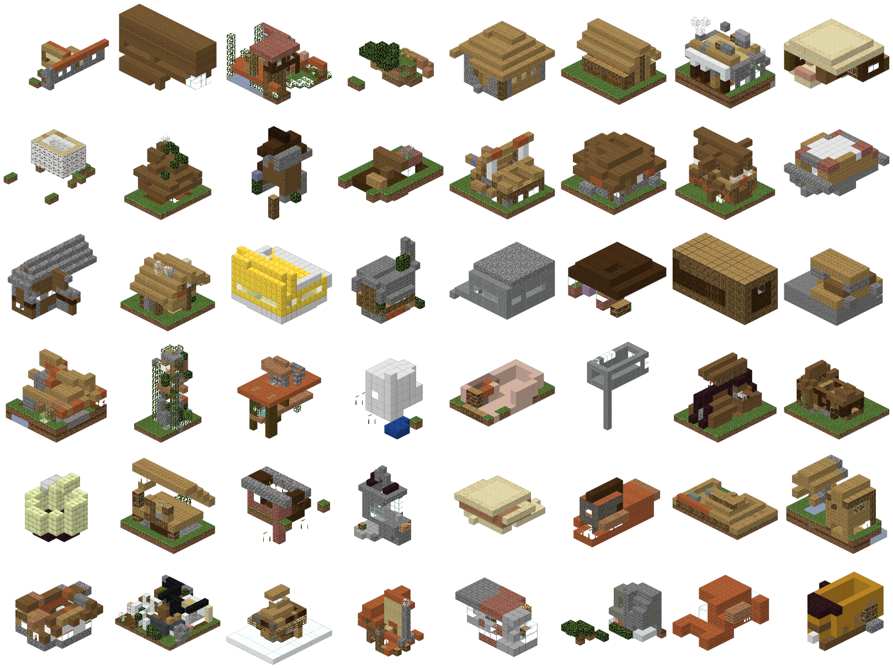

# Results

The authoritative, dated tables live in [`results.md`](https://github.com) at the repo
root (T-series) and the methods ledger in `notes.md §7` (proven ideas). This page
summarizes the current headlines; regenerate everything with the
[experiment runners](experiments.md).

Novelty protocol: dedup → held-out val split → D4 augment (train only) → evaluate against
*distinct real builds*. `val_nn` is the honest number (nearest-neighbor IoU to unseen
builds); the real-build baseline is ≈0.48 for houses. `dup` is the fraction of samples
that copy a training build.

## Proven levers (what actually moved quality)

| Lever | Effect | Evidence |
|---|---|---|
| **Adjacency-constrained decoding** | **validity 1.0 by construction**, ~quality-neutral | T11 `ar_raster_constrained` |
| **Category conditioning** | best cohesion lever — top val_nn + raw validity | T10 (`ar_conditioned`) |
| **grammar-aware phase4 PE** | small, honest val_nn win (+2.5%) | T11 best arm (0.405) |
| **3D-BPE cluster tokens** | anti-memorization (dup 0 where flat memorizes) | T10 vehicles |
| **More data** | raw validity 3× (0.188 → 0.562) | T10 gc → combined |
| Honest-novelty eval | zero duplicates on houses everywhere | T10/T11 |

The two winners **do not stack** — constrained decoding already pins validity at 1.0, so
phase4's gain is redundant on top of it. Recipe: **raster order + adjacency constraint**,
optionally phase4 PE. BFS order *hurts*; generic relative PE (RoPE/ALiBi) does **not** win.

## T11 — ideas ablation battery (run `20260704_001222_ideas`, 13 arms, 15.4 h)

AR still dominates; the best arm reaches **84% of the real-build baseline with zero
duplicates**.

| arm | nn_iou | val_nn | validity raw→gated | occ | note |
|---|--:|--:|---|--:|---|
| **ar_pe_phase4** | **0.456** | **0.405** | 0.375→1.0 | 285 | best arm — grammar-aware PE |
| ar_pe_rope | 0.454 | 0.391 | 0.062→1.0 | 211 | ties on nn_iou, worse val_nn |
| ar_pe_learned | 0.442 | 0.395 | 0.312→1.0 | 239 | baseline PE |
| **ar_raster_constrained** | 0.428 | 0.383 | **1.0 (by constr.)** | 235 | validity floor, quality-neutral |
| ar_pe_alibi | 0.391 | 0.346 | 0.375→1.0 | 254 | weakest PE |
| diff32_stratified | 0.259 | 0.218 | 0.0 | 830 | best sampler, still ≪ AR |
| twostage32 | 0.382 | 0.335 | 0.0 | 12968 | best diffusion shape; overfills ~9× |

Diffusion at 32³ stays uncalibrated — neither smarter samplers nor two-stage factoring
closed the gap to AR. Fresh samples, real-texture render (`scripts/render_model_samples.py`):

| real reference | `ar_raster_constrained` | `ar_pe_phase4` | `diff32_maskgit` |
|---|---|---|---|
|  |  |  |  |

/// caption
Canonical-16 samples. **Constrained** decoding gives visibly single-component, house-gestalt
massing (validity 1.0). **phase4** matches quality with the best val-NN (occasional
floaters). **diff32_maskgit** scatters translucent blobs (validity 0) — matches its metrics.
///

## T10 — cohesion + data battery (run `20260702_022207_overnight`, 18 arms, 28.1 h)

3 datasets × 6 tracks. **Category conditioning is the best all-around lever**; more data
lifts validity 3×; graph-VAE never memorizes but trails AR.

| dataset | track | nn_iou | dup ↓ | val_nn | valid raw→gated |
|---|---|--:|--:|--:|---|
| combined | **ar_conditioned** | **0.481** | 0.0 | **0.435** | 0.4→1.0 |
| combined | ar_flat | 0.475 | 0.0 | 0.408 | 0.562→1.0 |
| gc-houses | ar_flat | 0.485 | 0.0 | 0.412 | 0.188→1.0 |
| vehicles | **ar_cluster** | **0.598** | **0.0** | 0.46 | 0.562→1.0 |
| vehicles | ar_flat | 0.568 | 0.125 ⚠ | 0.446 | 0.625→1.0 |

Best tracks hit **85–93% of the val-baseline** with dup 0. **3D-BPE cluster tokens** are
object-type-dependent: on vehicles they're the best track *and* stay dup 0 while flat
memorizes (0.125); on houses at 16³ they trail flat (big learned pieces get placed
disconnected). Chunk emission generalizes but doesn't automatically cohere.

## T12 — pool-pretrain → finetune on `houses_32` (run `20260708_070807_transfer`, 11.4 h)

Pool = 16,383 builds / 113k aug sequences across all five corpora, val excluded by source;
phase4 AR @ canon-16; scratch vs pretrain(30ep)→finetune(60ep).

| arm | val_nn | val_nn (constrained) | validity | dup | final loss |
|---|--:|--:|--:|--:|--:|
| **scratch (control)** | **0.405** | 0.378 | 0.5→1.0 gated / 1.0 constr | 0 | 0.181 |
| pretrain zero-shot | 0.365 | 0.301 | 0.375 / 1.0 | 0 | — |
| pretrain→finetune | 0.379 | 0.327 | 0.375 / 1.0 | 0 | **0.142** |

/// caption
`samples_transfer_finetune` — the pool-pretrained-then-finetuned arm. Visually ≈ the
scratch control despite 22% lower train loss: **compression ≠ generation.**
///

**Verdict: NO in-domain transfer gain** — finetune trails scratch on val-NN despite 22%
lower train loss (1 seed, 16 samples ⇒ ±~0.03 noise). Positives: houses_32-scratch matches
the best T11 val_nn (0.405) on a *cleaner* dataset (curated cache validated), and the
zero-shot pool model reaches 0.365 with no house-specific training. The transfer claim is
reframed for the data-**poor** LEGO regime (see [Roadmap](roadmap.md)).

## Earlier milestones

- **GrabCraft medieval-houses** (`20260701_053401`): AR made crisp palette-correct houses
  (NN-IoU 0.727) but **memorized ~31%** — the motivation for the honest-novelty protocol,
  dedup, and val splits now standard above.
- **AR vs diffusion on canonical 12³ houses** (`20260630_232913_gen`): AR wins once
  scale-normalized (NN-IoU 0.568 vs 0.369). MaskGIT under-fills a sharp net (occ 60 vs
  185); flow matching holds density.
- **Embeddings**: flat learned block embeddings do **not** develop family structure
  (wood/wool within-family cos-sim ≈ random) — motivates factored `(family, variant)`
  embeddings. See [Representations](representations.md#do-we-have-embeddings-for-tokens-voxels).

/// caption
Generated house gestalts (left) vs distinct real houses (NN-IoU 0.38–0.49) — novel, not
memorized.
///

## Known limitations

- **Diffusion at 32³ uncalibrated** — occupancy control fragile, validity 0 raw; AR is the
  flagship, diffusion the novelty-safe complement at ≤24³.
- **Block-class agreement low** (~0.03–0.15) — shape is learned, exact materials are
  interchanged → factored embeddings + shape/palette decoupling (top open ideas).
- **No cross-medium transfer gain in the data-rich regime** (T12) — reframed for LEGO.
- Single-seed, 16-sample arms; occupancy is sampling-sensitive → treat single numbers as
  directional.
